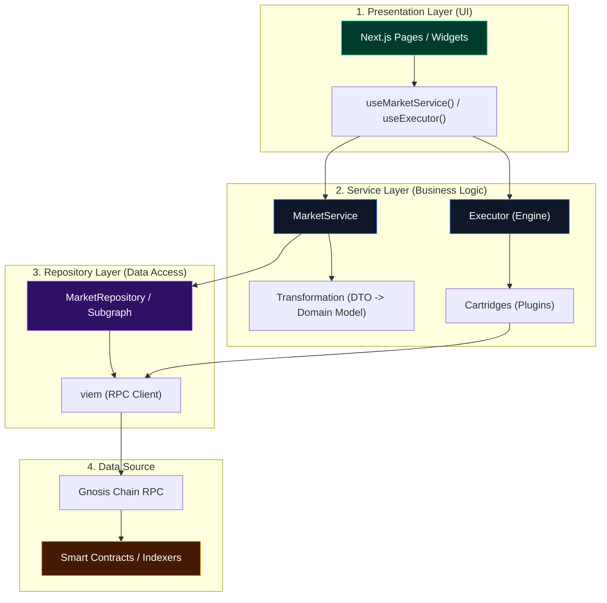

# Architecture Guide: Futarchy Interface

This document outlines the core architectural patterns used in this project to ensure scalability, testability, and a clean separation of concerns.

## 1. High-Level Flow (The 4 Layers)

The project follows a strict top-down data flow to keep the UI decoupled from the blockchain.

## 2. Core Patterns

### A. The Executor & Cartridge Pattern
To prevent "Contract Spaghetti" in the UI, we use a central **Executor**.
*   **Executor**: A generic engine that exposes a `run(command, args)` method.
*   **Cartridges**: Plugins that register specific implementations for commands (e.g., `market.getBalance`).
*   **Discovery**: Cartridges fetch their own required addresses (like YES/NO tokens) from the blockchain during an "installation" phase, so the UI doesn't have to manage addresses.

### B. The Widget "Hive" Architecture
Widgets are treated as isolated "micro-applications."
*   **Isolation**: Widgets (in `src/widgets`) do not import each other.
*   **Event Bus**: Communication happens via a global, type-safe event bus (`src/core/bus`).
*   **Adapters**: Each widget has its own `adapters/` to normalize data for its specific needs.

### C. Repository vs. Service
*   **Repository**: Returns "Raw" Data Transfer Objects (DTOs). It only cares about *how* to get the data (RPC, fetch, etc.).
*   **Service**: Returns "Clean" Domain Models. It handles business logic, filtering, and data transformation.

## 3. Data Fetching Example: Market Metadata
1.  **UI**: Calls `MarketService.getMarket(id)`.
2.  **Service**: Calls `MarketRepository.fetchMarket(id)`.
3.  **Repository**: Executes a `viem` **multicall** to fetch `marketName`, `collateralToken`, and `wrappedOutcome(indexes)` in one request.
4.  **Transformation**: The Repository returns the DTO $\rightarrow$ The Service transforms it into a clean `MarketModel` (converting BigInts, formatting strings, etc.).

## 4. Configuration & Mocking
*   **No Hardcoding**: All critical addresses are stored in `src/config/mocks.ts` or `src/config/contracts.ts`.
*   **Mocks**: During development, services can return mocked data to allow UI prototyping before the full backend is live.

---
*Last Updated: Dec 2025*
