# Swap Implementation Comparison

Comprehensive comparison of swap methods in the futarchy-web application, including approval flows, contract addresses, and practical examples.

---

## Table of Contents
- [Quick Comparison Matrix](#quick-comparison-matrix)
- [Approval Flow Differences](#approval-flow-differences)
- [Contract Addresses](#contract-addresses)
- [Detailed Examples](#detailed-examples)
- [Step-by-Step Flows](#step-by-step-flows)

---

## Quick Comparison Matrix

| Feature | UniswapSDK | SushiSwapV3 | CoW Swap | Algebra (Swapr) |
|---------|------------|-------------|----------|-----------------|
| **Approval Steps** | 2-step (Permit2) | 1-step (Direct) | 1-step (Direct) | 1-step (Direct) |
| **Spender Address** | Permit2 → Universal Router | SushiSwap V3 Router | CoW Vault Relayer | Swapr Router |
| **Chain Support** | Multi-chain | Gnosis only | Gnosis only | Gnosis only |
| **Order Type** | On-chain | On-chain | Off-chain | On-chain |
| **Split Required** | Yes | Yes | Yes | Yes |
| **Gas Limit** | 350k-500k | 50M (high) | N/A (off-chain) | 500k |
| **Slippage Protection** | Built-in | Manual | Quote-based | Manual |

---

## Approval Flow Differences

### 🔵 UniswapSDK (2-Step Permit2 Flow)

```
Step 1: Token → Permit2
├─ Contract: 0x000000000022D473030F116dDEE9F6B43aC78BA3
├─ Amount: MaxUint256
└─ Function: token.approve(permit2Address, MaxUint256)

Step 2: Permit2 → Universal Router
├─ Contract: 0x66a9893cc07d91d95644aedd05d03f95e1dba8af (Ethereum)
│            0x1095692a6237d83c6a72f3f5efedb9a670c49223 (Gnosis)
├─ Amount: MaxUint160
├─ Expiration: Max (0xffffffffffff)
└─ Function: permit2.approve(token, router, amount, expiration)

Final Swap: Universal Router
└─ Commands: [V3_SWAP_EXACT_IN (0x00), SWEEP (0x04)]
```

**Why 2 steps?**
- Permit2 acts as a universal approval manager
- Reduces approval transactions for frequent traders
- Allows batched operations and signature-based approvals

### 🟠 SushiSwapV3 (1-Step Direct Flow)

```
Step 1: Token → SushiSwap V3 Router
├─ Contract: 0x592abc3734cd0d458e6e44a2db2992a3d00283a4
├─ Amount: MaxUint256
└─ Function: token.approve(routerAddress, MaxUint256)

Final Swap: V3 Router
└─ Function: router.swap(pool, recipient, zeroForOne, amount, sqrtPriceLimitX96, "0x")
```

**Why 1 step?**
- Direct approval to router
- Simpler flow, less abstraction
- Lower gas on first approval

### 🟢 CoW Swap (1-Step to Relayer)

```
Step 1: Token → CoW Vault Relayer
├─ Contract: 0xC92E8bdf79f0507f65a392b0ab4667716BFE0110
├─ Amount: MaxUint256
└─ Function: token.approve(vaultRelayerAddress, MaxUint256)

Final Order: Off-chain signed order
├─ API: https://api.cow.fi/xdai/api/v1/quote
└─ Returns: Order ID (not tx hash)
```

**Why off-chain?**
- MEV protection through batch auctions
- No gas for failed orders
- Better price execution

### 🟣 Algebra/Swapr (1-Step Direct Flow)

```
Step 1: Token → Swapr Router
├─ Contract: 0xffb643e73f280b97809a8b41f7232ab401a04ee1
├─ Amount: MaxUint256
└─ Function: token.approve(routerAddress, MaxUint256)

Final Swap: Algebra Router
└─ Function: router.exactInputSingle(params)
```

---

## Contract Addresses

### 🌐 Multi-Chain (UniswapSDK)

**Permit2 (Same on all chains)**
```
0x000000000022D473030F116dDEE9F6B43aC78BA3
```

**Universal Router (Chain-specific)**
```
Ethereum (1):  0x66a9893cc07d91d95644aedd05d03f95e1dba8af
Polygon (137): 0x1095692a6237d83c6a72f3f5efedb9a670c49223
Optimism (10): 0xb555edF5dcF85f42cEeF1f3630a52A108E55A654
Arbitrum (42161): 0x4C60051384bd2d3C01bfc845Cf5F4b44bcbE9de5
Gnosis (100): 0x1095692a6237d83c6a72f3f5efedb9a670c49223
```

### 🟧 Gnosis Chain Only (All Other Methods)

**Core Contracts**
```
Conditional Tokens: 0xCeAfDD6bc0bEF976fdCd1112955828E00543c0Ce
Futarchy Router:    0x7495a583ba85875d59407781b4958ED6e0E1228f
Wrapper Service:    0xc14f5d2B9d6945EF1BA93f8dB20294b90FA5b5b1
```

**Routers**
```
SushiSwap V2 Router: 0xf2614A233c7C3e7f08b1F887Ba133a13f1eb2c55
SushiSwap V3 Router: 0x592abc3734cd0d458e6e44a2db2992a3d00283a4
Swapr/Algebra Router: 0xffb643e73f280b97809a8b41f7232ab401a04ee1
CoW Vault Relayer:   0xC92E8bdf79f0507f65a392b0ab4667716BFE0110
CoW Settlement:      0x9008D19f58AAbD9eD0D60971565AA8510560ab41
```

**Base Tokens**
```
sDAI (Currency): 0xaf204776c7245bF4147c2612BF6e5972Ee483701
GNO (Company):   0x9C58BAcC331c9aa871AFD802DB6379a98e80CEdb
wxDAI:          0xe91D153E0b41518A2Ce8Dd3D7944Fa863463a97d
```

**Wrapped Position Tokens (YES)**
```
YES_sDAI: 0x2301e71f6c6dc4f8d906772f0551e488dd007a99
YES_GNO:  0xb28dbe5cd5168d2d94194eb706eb6bcd81edb04e
```

**Wrapped Position Tokens (NO)**
```
NO_sDAI: 0xb9d258c84589d47d9c4cab20a496255556337111
NO_GNO:  0xad34b43712588fa57d80e76c5c2bcbd274bdb5c0
```

**V3 Pools**
```
YES Pool: 0x9a14d28909f42823ee29847f87a15fb3b6e8aed3 (Fee: 1%)
NO Pool:  0x6E33153115Ab58dab0e0F1E3a2ccda6e67FA5cD7 (Fee: 1%)
```

---

## Detailed Examples

### Example 1: Buy YES Position with UniswapSDK

#### Initial State
```javascript
User Balance: 10 sDAI
Target: Buy 5 YES_GNO tokens
Chain: Gnosis (100)
```

#### Transaction Sequence

**1. Split Collateral**
```javascript
// Contract: Futarchy Router (0x7495a583ba85875d59407781b4958ED6e0E1228f)
await futarchyRouter.splitPosition(
  proposalAddress,
  sdaiAddress, // 0xaf204776c7245bF4147c2612BF6e5972Ee483701
  ethers.utils.parseEther("5") // 5 sDAI
);

// Result: Receive 5 YES_sDAI + 5 NO_sDAI
```

**2a. Approval Step 1: sDAI → Permit2**
```javascript
// Contract: sDAI token
// Spender: Permit2 (0x000000000022D473030F116dDEE9F6B43aC78BA3)
await sdaiContract.approve(
  "0x000000000022D473030F116dDEE9F6B43aC78BA3",
  ethers.constants.MaxUint256
);

// Gas: ~50k
// Only needed once per token
```

**2b. Approval Step 2: Permit2 → Universal Router**
```javascript
// Contract: Permit2
// Spender: Universal Router (0x1095692a6237d83c6a72f3f5efedb9a670c49223)
await permit2Contract.approve(
  sdaiAddress,
  "0x1095692a6237d83c6a72f3f5efedb9a670c49223",
  "0xffffffffffffffffffffffffffffffffffffffff", // MaxUint160
  "0xffffffffffff" // Max expiration
);

// Gas: ~60k
// Only needed once per token
```

**3. Execute Swap**
```javascript
// Contract: Universal Router
const commands = "0x0004"; // V3_SWAP_EXACT_IN + SWEEP
const inputs = [
  // V3 swap params
  abiCoder.encode(
    ['address', 'uint256', 'uint256', 'bytes', 'bool'],
    [
      recipient,
      amountIn, // 5 sDAI
      minAmountOut,
      path, // sDAI → YES_GNO (fee encoded)
      true // payerIsUser
    ]
  ),
  // Sweep params
  abiCoder.encode(
    ['address', 'address', 'uint256'],
    [tokenOut, recipient, minAmountOut]
  )
];

await universalRouter.execute(commands, inputs, deadline);

// Gas: ~350k
// Result: Receive ~5 YES_GNO
```

#### Summary
```
Total Transactions: 3 (or 1 if already approved)
Total Gas: ~460k (first time) or ~350k (subsequent)
Approvals Needed: 2 contracts, but cached indefinitely
Final Holdings: 5 YES_GNO, 5 NO_sDAI, 5 sDAI
```

---

### Example 2: Same Trade with SushiSwapV3

#### Transaction Sequence

**1. Split Collateral** (Identical)
```javascript
await futarchyRouter.splitPosition(proposalAddress, sdaiAddress, "5 ether");
// Result: Receive 5 YES_sDAI + 5 NO_sDAI
```

**2. Approval: YES_sDAI → SushiSwap V3 Router**
```javascript
// Contract: YES_sDAI token
// Spender: SushiSwap V3 Router (0x592abc3734cd0d458e6e44a2db2992a3d00283a4)
await yesSdaiContract.approve(
  "0x592abc3734cd0d458e6e44a2db2992a3d00283a4",
  ethers.constants.MaxUint256
);

// Gas: ~50k
// Only needed once per token
```

**3. Execute Swap**
```javascript
// Contract: SushiSwap V3 Router
// Pool: YES Pool (0x9a14d28909f42823ee29847f87a15fb3b6e8aed3)

// Determine swap direction
const token0 = await poolContract.token0(); // YES_sDAI
const token1 = await poolContract.token1(); // YES_GNO
const zeroForOne = true; // Swapping token0 → token1

const MIN_SQRT_RATIO = "4295128740";
const sqrtPriceLimitX96 = MIN_SQRT_RATIO; // For zeroForOne = true

await sushiV3Router.swap(
  "0x9a14d28909f42823ee29847f87a15fb3b6e8aed3", // pool
  recipient,
  zeroForOne,
  ethers.utils.parseEther("5"), // amount
  sqrtPriceLimitX96,
  "0x", // empty data
  { gasLimit: 50000000 } // High limit for safety
);

// Gas: ~200-300k (actual usage much lower)
// Result: Receive ~5 YES_GNO
```

#### Summary
```
Total Transactions: 2 (or 1 if already approved)
Total Gas: ~300k (first time) or ~250k (subsequent)
Approvals Needed: 1 contract per token
Final Holdings: 5 YES_GNO, 5 NO_sDAI, 5 sDAI
```

---

### Example 3: Same Trade with CoW Swap

#### Transaction Sequence

**1. Split Collateral** (Identical)
```javascript
await futarchyRouter.splitPosition(proposalAddress, sdaiAddress, "5 ether");
// Result: Receive 5 YES_sDAI + 5 NO_sDAI
```

**2. Approval: YES_sDAI → CoW Vault Relayer**
```javascript
// Contract: YES_sDAI token
// Spender: CoW Vault Relayer (0xC92E8bdf79f0507f65a392b0ab4667716BFE0110)
await yesSdaiContract.approve(
  "0xC92E8bdf79f0507f65a392b0ab4667716BFE0110",
  ethers.constants.MaxUint256
);

// Gas: ~50k
// Only needed once per token
```

**3. Get Quote from CoW API**
```javascript
// API Call: https://api.cow.fi/xdai/api/v1/quote
const quoteParams = {
  kind: "sell",
  sellToken: "0x2301e71f6c6dc4f8d906772f0551e488dd007a99", // YES_sDAI
  buyToken: "0xb28dbe5cd5168d2d94194eb706eb6bcd81edb04e", // YES_GNO
  sellAmountBeforeFee: "5000000000000000000", // 5 sDAI
  userAddress: recipient,
  validTo: Math.floor(Date.now() / 1000) + 3600,
  receiver: recipient,
  partiallyFillable: false
};

const quoteResponse = await fetch(apiUrl, {
  method: 'POST',
  body: JSON.stringify(quoteParams)
});

// Response includes:
// - buyAmount: Expected output
// - feeAmount: Protocol fee (often 0)
// - validTo: Order expiration
```

**4. Sign and Submit Order**
```javascript
const order = {
  kind: OrderKind.SELL,
  sellToken: quote.sellToken,
  buyToken: quote.buyToken,
  sellAmount: "5000000000000000000",
  buyAmount: quote.buyAmount, // From API
  receiver: recipient,
  validTo: quote.validTo,
  appData: quote.appData,
  feeAmount: "0"
};

// Sign with wallet
const signedOrder = await cowSdk.signOrder(order);

// Submit to API
const orderId = await cowSdk.cowApi.sendOrder({
  order: { ...order, ...signedOrder },
  owner: recipient
});

// NO ON-CHAIN TRANSACTION YET
// Order waits in off-chain orderbook
// Solvers compete to fill it
```

**5. Order Settlement** (Happens later)
```javascript
// Solver executes order in batch auction
// Transaction submitted by solver, not user
// User only pays approval gas
// Settlement happens at CoW Settlement contract
// Final result: Receive ~5 YES_GNO
```

#### Summary
```
Total Transactions: 1 on-chain (approval only)
User Gas Cost: ~50k (approval only)
Settlement Gas: Paid by solver
Execution Time: 1-5 minutes (batch auction)
MEV Protection: Yes
Final Holdings: 5 YES_GNO, 5 NO_sDAI, 5 sDAI
```

---

## Step-by-Step Flows

### 🔵 UniswapSDK Complete Flow

```mermaid
flowchart TD
    A[Start: 10 sDAI] --> B[Split 5 sDAI]
    B --> C{Permit2 Approved?}
    C -->|No| D[Approve Token → Permit2]
    C -->|Yes| E{Router Approved?}
    D --> E
    E -->|No| F[Approve Permit2 → Router]
    E -->|Yes| G[Build Swap Commands]
    F --> G
    G --> H[Encode V3_SWAP_EXACT_IN]
    H --> I[Encode SWEEP]
    I --> J[Execute Universal Router]
    J --> K[Receive YES_GNO]
```



**Contract Interactions:**
1. `Futarchy Router.splitPosition()`
2. `sDAI.approve(Permit2)` *(once per token)*
3. `Permit2.approve(UniversalRouter)` *(once per token)*
4. `UniversalRouter.execute(commands, inputs)`

---

### 🟠 SushiSwapV3 Complete Flow

```mermaid
flowchart TD
    A[Start: 10 sDAI] --> B[Split 5 sDAI]
    B --> C{Router Approved?}
    C -->|No| D[Approve YES_sDAI → V3 Router]
    C -->|Yes| E[Get Pool Info]
    D --> E
    E --> F[Determine zeroForOne]
    F --> G[Set sqrtPriceLimitX96]
    G --> H[Execute Router.swap]
    H --> I[Receive YES_GNO]
```



**Contract Interactions:**
1. `Futarchy Router.splitPosition()`
2. `YES_sDAI.approve(SushiV3Router)` *(once per token)*
3. `SushiV3Router.swap(pool, recipient, zeroForOne, amount, ...)`

---

### 🟢 CoW Swap Complete Flow


**Contract Interactions:**
1. `Futarchy Router.splitPosition()`
2. `YES_sDAI.approve(VaultRelayer)` *(once per token)*
3. *(Off-chain: Quote → Sign → Submit)*
4. *(Solver executes settlement)*

---

## Key Takeaways

### When to Use UniswapSDK
✅ Multi-chain support needed
✅ High-frequency trading (Permit2 saves gas long-term)
✅ Complex routing or multi-hop swaps
✅ Need for batched operations

❌ First-time user (2 approvals upfront)
❌ Small one-time trades

### When to Use SushiSwapV3
✅ Simple single-hop swaps
✅ Gnosis Chain only
✅ Want direct pool interaction
✅ Lower initial approval overhead

❌ Need MEV protection
❌ Multi-chain requirement

### When to Use CoW Swap
✅ Best price execution
✅ MEV protection critical
✅ Large trades
✅ Can wait 1-5 minutes

❌ Need instant execution
❌ Very small trades (solver may not fill)

### When to Use Algebra/Swapr
✅ Gnosis Chain liquidity fragmentation
✅ Specific pool preferences
✅ Alternative to SushiSwap pools

❌ Generally superseded by other methods

---

## Gas Cost Comparison

| Method | First Trade | Subsequent Trades | Notes |
|--------|-------------|-------------------|-------|
| **UniswapSDK** | ~460k gas | ~350k gas | 2 approvals initially |
| **SushiSwapV3** | ~300k gas | ~250k gas | 1 approval per token |
| **CoW Swap** | ~50k gas | ~0 gas | User only pays approval |
| **Algebra** | ~300k gas | ~250k gas | Similar to SushiV3 |

---

## Error Handling Examples

### UniswapSDK Common Errors

```javascript
// Error: Permit2 approval expired
// Solution: Re-approve Permit2 → Router
await checkPermit2Approval(); // Returns expiration status
if (expired) {
  await approvePermit2ToRouter(tokenAddress, signer);
}

// Error: Insufficient output amount
// Solution: Adjust slippage or check pool liquidity
const minOutput = calculateMinOutput(amountIn, slippageTolerance);
```

### SushiSwapV3 Common Errors

```javascript
// Error: "Too little received"
// Solution: Increase sqrtPriceLimitX96 tolerance
const sqrtPriceLimitX96 = zeroForOne
  ? MIN_SQRT_RATIO  // More permissive
  : MAX_SQRT_RATIO;

// Error: Wrong swap direction
// Solution: Verify token0/token1 order
const token0 = await pool.token0();
const zeroForOne = tokenIn.toLowerCase() === token0.toLowerCase();
```

### CoW Swap Common Errors

```javascript
// Error: "InsufficientFee"
// Solution: Quote API calculates fee, ensure feeAmount included
const order = {
  ...quote,
  feeAmount: quote.feeAmount || "0"
};

// Error: Order not filled
// Solution: Wait longer or adjust limit price
// Orders can take 1-5 minutes in batch auctions
```

---

## Testing Commands

```bash
# Test Uniswap SDK swap
npm run test:uniswap-sdk

# Test SushiSwap V3 swap
npm run test:sushiv3

# Test CoW Swap order
npm run test:cowswap

# Interactive swap testing
npm run swap-test
```

---

## Additional Resources

- [Uniswap Universal Router Docs](https://docs.uniswap.org/contracts/universal-router/overview)
- [Permit2 Specification](https://docs.uniswap.org/contracts/permit2/overview)
- [CoW Protocol Documentation](https://docs.cow.fi/)
- [SushiSwap V3 Docs](https://dev.sushi.com/)
- [Algebra Protocol](https://algebra.finance/docs)

---

*Last Updated: 2025-10-02*
