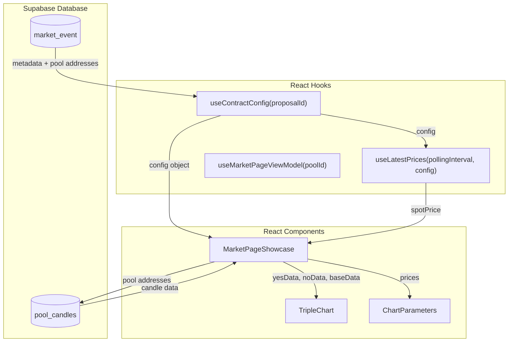
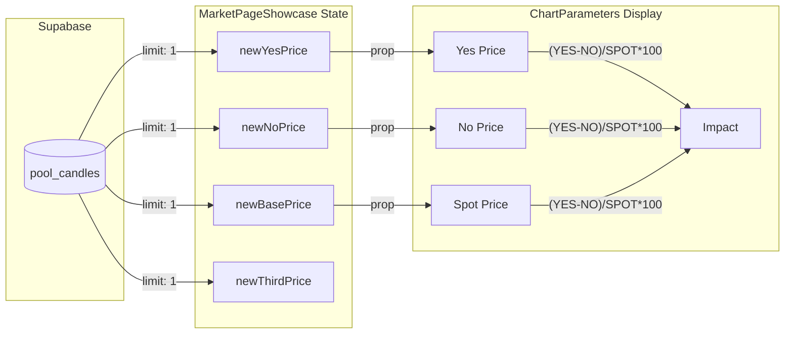

# MarketPageShowcase Data Flow Documentation

This document provides a comprehensive overview of how the **MarketPageShowcase** component obtains pool addresses from `useContractConfig`, fetches data from Supabase (`pool_candles` and `pool_interval`), and populates the **TripleChart** and **ChartParameters** components.

---

## High-Level Architecture



---

## Components Overview

### 1. MarketPageShowcase.jsx
**Location**: `src/components/futarchyFi/marketPage/MarketPageShowcase.jsx`

The main container component (~5700 lines) that orchestrates all data fetching and passes data to child components.

### 2. useContractConfig Hook
**Location**: `src/hooks/useContractConfig.js`

Fetches proposal/market configuration from Supabase `market_event` table and transforms it into a usable config object.

### 3. TripleChart Component
**Location**: `src/components/chart/TripleChart.jsx`

Renders the three-line chart (YES, NO, SPOT) using the `lightweight-charts` library.

### 4. ChartParameters Component
**Location**: `src/components/futarchyFi/marketPage/tripleChart/chartParameters/ChartParameters.jsx`

Displays the price parameters (Spot Price, YES Price, NO Price, Impact) above the chart.

---

## Data Flow Step-by-Step

### Step 1: Proposal ID Extraction

The `useContractConfig` hook extracts the `proposalId` from URL parameters or props:

```javascript
// useContractConfig.js (lines 21-58)
let extractedProposalId = proposalId;

if (typeof window !== 'undefined') {
  const urlParams = new URLSearchParams(window.location.search);
  const proposalFromUrl = urlParams.get('proposalId');
  
  if (proposalFromUrl) {
    extractedProposalId = proposalFromUrl;
  }
}
```

### Step 2: Fetch Market Configuration from Supabase

The hook queries the `market_event` table:

```javascript
// useContractConfig.js (lines 64-69)
const { data, error } = await supabase
  .from('market_event')
  .select('*')
  .eq('id', extractedProposalId)
  .single();
```

### Step 3: Extract Pool Addresses from Metadata

The `metadata` field contains pool configuration for YES, NO, and BASE pools:

```javascript
// useContractConfig.js (lines 152-221)
POOL_CONFIG_YES: {
  address: metadata.conditional_pools?.yes?.address || data.pool_yes,
  tokenCompanySlot: metadata.conditional_pools?.yes?.tokenCompanySlot ?? 1,
},

POOL_CONFIG_NO: {
  address: metadata.conditional_pools?.no?.address || data.pool_no,
  tokenCompanySlot: metadata.conditional_pools?.no?.tokenCompanySlot ?? 0,
},

BASE_POOL_CONFIG: {
  address: metadata.base_pool?.address,
  type: metadata.base_pool?.type || 'DXswapPair',
  currencySlot: metadata.base_pool?.currencySlot ?? 0
}
```

### Step 4: MarketPageShowcase Receives Config

The component uses the hook and extracts pool configurations:

```javascript
// MarketPageShowcase.jsx (lines 2492-2502)
const POOL_CONFIG_YES = config?.POOL_CONFIG_YES;
const POOL_CONFIG_NO = config?.POOL_CONFIG_NO;
const POOL_CONFIG_THIRD = config?.POOL_CONFIG_THIRD;
const PREDICTION_POOLS = config?.PREDICTION_POOLS;
const hasSpot = !!config?.BASE_POOL_CONFIG?.address && 
                config?.BASE_POOL_CONFIG?.address !== "0x00";
```

### Step 5: Fetch Price Data from pool_candles

The component fetches latest prices from Supabase `pool_candles`:

```javascript
// MarketPageShowcase.jsx (lines 2570-2592)
const [yesResult, noResult, thirdResult, baseResult] = await Promise.all([
  supabasePoolFetcher.fetch('pools.candle', {
    id: config.POOL_CONFIG_YES.address,
    limit: 1
  }),
  supabasePoolFetcher.fetch('pools.candle', {
    id: config.POOL_CONFIG_NO.address,
    limit: 1
  }),
  config.POOL_CONFIG_THIRD?.address
    ? supabasePoolFetcher.fetch('pools.candle', {
        id: config.POOL_CONFIG_THIRD.address,
        limit: 500
      })
    : Promise.resolve(null),
  config.BASE_POOL_CONFIG?.address
    ? supabasePoolFetcher.fetch('pools.candle', {
        id: config.BASE_POOL_CONFIG.address,
        limit: 1
      })
    : Promise.resolve(null)
]);
```

### Step 6: Pass Data to TripleChart

The chart receives data via props:

```javascript
// MarketPageShowcase.jsx (lines 5146-5165)
<TripleChart
  propYesData={latestPrices.yesData}
  propNoData={latestPrices.noData}
  propBaseData={latestPrices.baseData}
  propEventProbabilityData={thirdCandles}
  shouldFetchData={false}
  selectedCurrency={selectedCurrency}
  sdaiRate={sdaiRate}
  config={config}
  spotPrice={newBasePrice !== null ? newBasePrice : latestPrices.spotPriceSDAI}
  chartFilters={{ ...chartFilters, spot: hasSpot && chartFilters.spot }}
  marketHasClosed={marketHasClosed}
/>
```

### Step 7: TripleChart Fetches Supabase Data

When `shouldFetchData` is true or using Supabase realtime, TripleChart fetches directly:

```javascript
// TripleChart.jsx (lines 273-331)
const { data: yesData, error: yesError } = await supabase
  .from('pool_candles')
  .select('timestamp, price')
  .eq('address', dynamicYesPoolAddress)
  .eq('interval', interval)
  .order('timestamp', { ascending: false })
  .limit(500);
```

---

## Supabase Tables

### `market_event` Table
Stores proposal/market configurations:

| Column | Description |
|--------|-------------|
| `id` | Proposal ID (address) |
| `title` | Market title |
| `metadata` | JSON with pool configs, tokens, etc. |
| `pool_yes` | YES pool address (fallback) |
| `pool_no` | NO pool address (fallback) |
| `end_date` | Market end time |
| `resolution_status` | "open", "resolved", etc. |
| `resolution_outcome` | Final outcome (YES/NO) |

### `pool_candles` Table
Stores historical price candles:

| Column | Description |
|--------|-------------|
| `address` | Pool address |
| `timestamp` | Unix timestamp (seconds) |
| `price` | Token price |
| `interval` | Candle interval (e.g., "3600000" = 1 hour) |
| `pool_interval_id` | Composite key for grouping |

---

## Key Configuration Objects

### Config from useContractConfig

```javascript
{
  proposalId: "0x...",
  MARKET_ADDRESS: "0x...",
  chainId: 100,
  
  // Pool Configurations
  POOL_CONFIG_YES: {
    address: "0x...",
    tokenCompanySlot: 1
  },
  POOL_CONFIG_NO: {
    address: "0x...",
    tokenCompanySlot: 0
  },
  BASE_POOL_CONFIG: {
    address: "0x...",
    type: "DXswapPair",
    currencySlot: 0
  },
  
  // Token Configurations
  BASE_TOKENS_CONFIG: {
    currency: { address: "0x...", symbol: "sDAI" },
    company: { address: "0x...", symbol: "GNO" }
  },
  
  // Market Info
  marketInfo: {
    title: "...",
    endTime: 1234567890,
    resolved: false,
    resolutionStatus: "open"
  },
  
  // Precision Settings
  PRECISION_CONFIG: {
    display: { price: 4 }
  }
}
```

---

## Price Inversion Logic

The system handles price inversion based on spot price relationship:

```javascript
// TripleChart.jsx (lines 170-198)
const processTokenData = (data, tokenType = 'TOKEN') => {
  const processedData = data.map(d => {
    if (!d.value || !effectiveSpotPrice) return d;

    // If spot price < 1: invert values > 1 to make them < 1
    // If spot price >= 1: invert values < 1 to make them > 1
    const shouldInvert = (effectiveSpotPrice < 1 && d.value > 1) || 
                         (effectiveSpotPrice >= 1 && d.value < 1);

    if (shouldInvert) {
      return { ...d, value: 1 / d.value };
    }
    return d;
  });

  return processedData;
};
```

---

## Spot Price Cropping

The `cropSpot` feature filters spot data to only include timestamps where YES/NO data exists:

```javascript
// TripleChart.jsx (lines 151-168)
const cropSpotData = (spotData, yesData, noData) => {
  if (!cropSpot || !spotData?.length) return spotData;

  // Create a Set of timestamps from YES and NO data
  const conditionalTimestamps = new Set();
  yesData.forEach(d => conditionalTimestamps.add(d.time));
  noData.forEach(d => conditionalTimestamps.add(d.time));

  // Filter spot data to only include matching timestamps
  return spotData.filter(d => conditionalTimestamps.has(d.time));
};
```

---

## Smart Spot Price Refetching

When initial spot data doesn't overlap with YES/NO timestamps, the system refetches:

```javascript
// TripleChart.jsx (lines 404-452)
if (croppedCount === 0 && conditionalTimestamps.size > 0) {
  // Get min/max timestamps from YES/NO data
  const timestamps = Array.from(conditionalTimestamps).sort((a, b) => a - b);
  const minTimestamp = timestamps[0];
  const maxTimestamp = timestamps[timestamps.length - 1];

  // Refetch spot data with timestamp filters
  const { data: refetchedBaseData } = await supabase
    .from('pool_candles')
    .select('timestamp, price')
    .eq('address', dynamicBasePoolAddress)
    .eq('interval', interval)
    .gte('timestamp', minTimestamp)
    .lte('timestamp', maxTimestamp)
    .order('timestamp', { ascending: true });
}
```

---

## Polling & Real-time Updates

### MarketPageShowcase Polling
```javascript
// MarketPageShowcase.jsx (lines 2693-2698)
if (config?.POOL_CONFIG_YES?.address && config?.POOL_CONFIG_NO?.address) {
  fetchLatestPricesFromSupabase();
  // Update every 30 seconds
  interval = setInterval(fetchLatestPricesFromSupabase, 30000);
}
```

### TripleChart Polling
```javascript
// TripleChart.jsx (lines 488-500)
fetchSupabaseData(); // Initial fetch
const intervalId = setInterval(() => {
  if (!isLoadingSupabase) {
    fetchSupabaseData();
  }
}, 60 * 1000); // Refetch every 60 seconds
```

---

## ChartParameters Data Flow (Yes Price, No Price, Spot Price, Impact)

The **ChartParameters** component displays the price bar above the chart (Trading Pair, Spot Price, Yes Price, No Price, and Impact).

### State Variables in MarketPageShowcase

The prices displayed in ChartParameters come from **the same state variables** that are populated by Supabase `pool_candles`:

```javascript
// MarketPageShowcase.jsx (lines 2255-2259)
const [newYesPrice, setNewYesPrice] = useState(null);
const [newNoPrice, setNewNoPrice] = useState(null);
const [newThirdPrice, setNewThirdPrice] = useState(null);  // Event probability
const [thirdCandles, setThirdCandles] = useState([]);      // Historical candles
const [newBasePrice, setNewBasePrice] = useState(null);    // Spot/base price
```

### How Prices Are Populated

These state variables are populated by the **fetchLatestPricesFromSupabase** function:

```javascript
// MarketPageShowcase.jsx (lines 2570-2592 and 2676-2679)
const [yesResult, noResult, thirdResult, baseResult] = await Promise.all([
  supabasePoolFetcher.fetch('pools.candle', {
    id: config.POOL_CONFIG_YES.address,
    limit: 1  // Only get the LATEST candle
  }),
  supabasePoolFetcher.fetch('pools.candle', {
    id: config.POOL_CONFIG_NO.address,
    limit: 1  // Only get the LATEST candle
  }),
  // ... thirdResult and baseResult
]);

// Extract the latest prices and set state
if (yesResult?.status === 'success' && yesResult.data.length > 0) {
  yesPrice = yesResult.data[0].price;  // LATEST price from pool_candles
}
if (noResult?.status === 'success' && noResult.data.length > 0) {
  noPrice = noResult.data[0].price;    // LATEST price from pool_candles
}

// Set state (lines 2676-2679)
setNewYesPrice(yesPrice);
setNewNoPrice(noPrice);
setNewThirdPrice(thirdPrice);
setNewBasePrice(basePrice);
```

### ChartParameters Props

The ChartParameters component receives these values as props:

```javascript
// MarketPageShowcase.jsx (lines 5092-5140)
<ChartParameters
  tradingPair={`${companySymbol}/${currencySymbol}`}
  
  // Spot Price - from pool_candles or useLatestPrices
  spotPrice={(latestPrices.loading && newBasePrice === null) ? null : (() => {
    const value = Number(newBasePrice !== null ? newBasePrice : latestPrices.spotPriceSDAI);
    // Currency conversion if needed (xDAI uses sDAI rate)
    return displayCurrency === 'WXDAI' && sdaiRate ? value * sdaiRate : value;
  })()}
  
  // YES Price - from pool_candles
  yesPrice={(newYesPrice === null) ? null : (() => {
    const value = Number(newYesPrice);
    return displayCurrency === 'WXDAI' && sdaiRate ? value * sdaiRate : value;
  })()}
  
  // NO Price - from pool_candles
  noPrice={(newNoPrice === null) ? null : (() => {
    const value = Number(newNoPrice);
    return displayCurrency === 'WXDAI' && sdaiRate ? value * sdaiRate : value;
  })()}
  
  // Event Probability - from third pool
  eventProbability={Math.min(Number(newThirdPrice), 1)}
  
  currency={currencySymbol}
  precision={config?.precisions?.main || 4}
  config={config}
/>
```

### Impact Calculation

The **Impact** value is calculated **inside ChartParameters**, not passed as a prop:

```javascript
// ChartParameters.jsx (lines 91-98)
let impact = 0;
if (showSpot && spotPrice > 0 && yesPrice !== null && noPrice !== null) {
  // Formula: (YES - NO) / SPOT * 100
  impact = ((yesPrice - noPrice) / spotPrice) * 100;
} else if (yesPrice !== null && noPrice !== null) {
  // Fallback if no spot price
  const denominator = Math.max(yesPrice, noPrice);
  impact = denominator > 0 ? ((yesPrice - noPrice) / denominator) * 100 : 0;
}
```

### Visual Diagram



### Shared Data Source with TripleChart

Both **ChartParameters** and **TripleChart** receive data from the **same source**:

| Component | Data Used | Query Type |
|-----------|-----------|------------|
| **ChartParameters** | `newYesPrice`, `newNoPrice`, `newBasePrice` | `limit: 1` (latest candle only) |
| **TripleChart** | `supabaseYesCandles`, `supabaseNoCandles`, `supabaseBaseCandles` | `limit: 500` (historical candles) |

The key difference:
- **ChartParameters**: Shows the **latest single price** (limit: 1)
- **TripleChart**: Shows **historical price timeline** (limit: 500)

---

## Summary

| Step | Source | Target | Data |
|------|--------|--------|------|
| 1 | URL/Props | useContractConfig | proposalId |
| 2 | Supabase `market_event` | useContractConfig | Proposal metadata |
| 3 | useContractConfig | MarketPageShowcase | Pool addresses, config |
| 4 | Supabase `pool_candles` | MarketPageShowcase | Latest prices |
| 5 | MarketPageShowcase | TripleChart | yesData, noData, baseData (500 candles) |
| 6 | MarketPageShowcase | ChartParameters | Spot/YES/NO prices (1 candle each) |
| 7 | ChartParameters | - | Calculates Impact from YES, NO, SPOT |
| 8 | TripleChart | Chart Library | Formatted candle data for chart lines |
