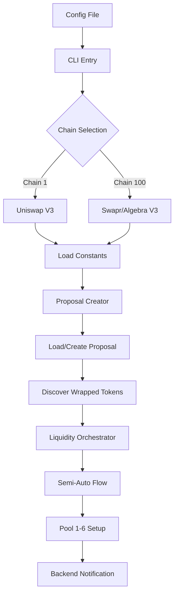
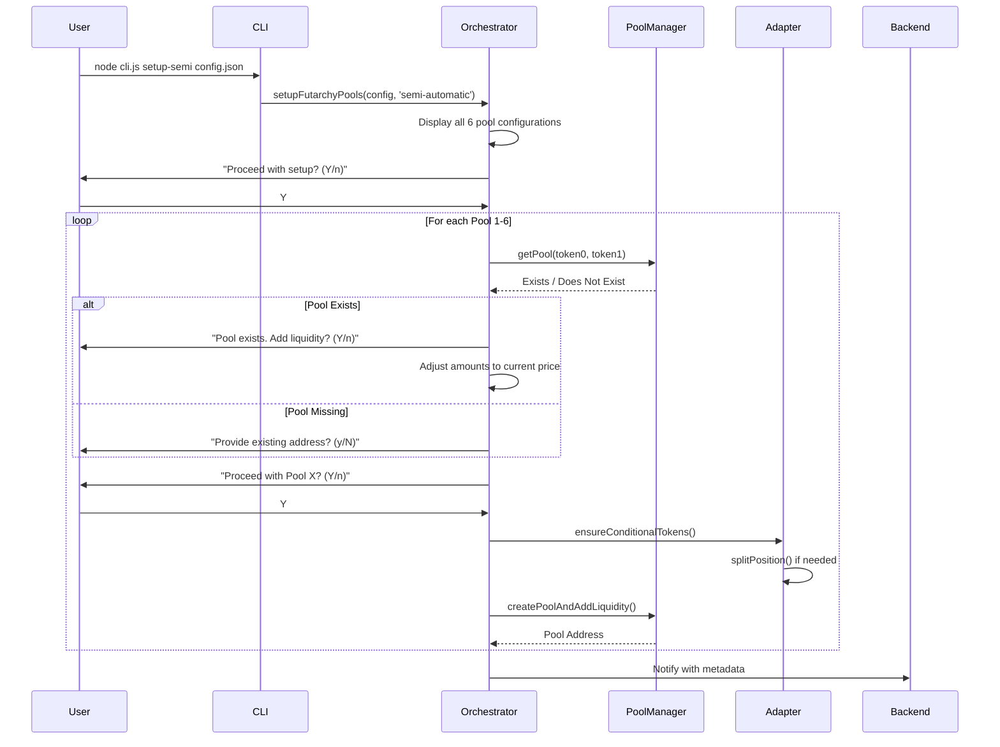
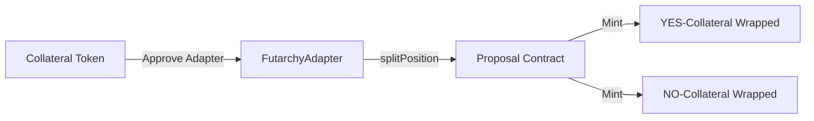

# RefactorCreateProposal SDK: Semi-Auto Mode Complete Documentation

This document provides a comprehensive technical breakdown of how the `refactorCreateProposal` SDK operates in **Semi-Automatic Mode** to create Futarchy proposals, split collateral into conditional tokens, and initialize the 6-pool structure across multiple chains and AMMs.

---

## Table of Contents
1. [Overview](#overview)
2. [Architecture & Flow Diagrams](#architecture--flow-diagrams)
3. [Multi-Chain Configuration](#multi-chain-configuration)
4. [AMM-Specific Logic](#amm-specific-logic)
5. [Semi-Auto Mode Workflow](#semi-auto-mode-workflow)
6. [The 6-Pool Structure](#the-6-pool-structure)
7. [Token Discovery & Split Mechanism](#token-discovery--split-mechanism)
8. [Gas Configuration](#gas-configuration)
9. [Contract Addresses Reference](#contract-addresses-reference)
10. [Config File Format](#config-file-format)
11. [Command Reference](#command-reference)

---

## Overview

The `refactorCreateProposal` SDK is a Node.js utility enabling automated deployment and liquidity seeding of Futarchy proposals. It handles:

- **Proposal Creation** via the `FutarchyFactory` contract
- **Conditional Token Splitting** via the `FutarchyAdapter`
- **6-Pool Initialization** via Uniswap V3 (Chain 1) or Swapr/Algebra V3 (Chain 100)
- **Backend Notification** with rich metadata for UI indexing



---

## Architecture & Flow Diagrams

### Module Hierarchy

| Module | Purpose |
|--------|---------|
| `cli.js` | Entry point, command routing, chain/AMM selection |
| `contracts/constants.js` | Dynamic config loading based on CHAIN_ID |
| `config/chains.config.json` | Multi-chain addresses, gas settings, RPCs |
| `modules/proposalCreator.js` | `FutarchyFactory.createProposal()` + `loadProposal()` |
| `modules/futarchyAdapter.js` | `splitPosition()` + `mergePositions()` + token discovery |
| `modules/poolManager.js` | Pool creation, price initialization, liquidity minting |
| `modules/liquidityOrchestrator.js` | Semi-auto flow, 6-pool coordination, confirmations |
| `utils/priceCalculations.js` | Target price calculation from spot/probability/impact |
| `utils/tokens.js` | Token metadata, balance management, allowances |

### Semi-Auto Mode Execution Flow



---

## Multi-Chain Configuration

The SDK dynamically loads configuration from `config/chains.config.json` based on `CHAIN_ID`:

### Supported Chains

| Chain ID | Network | Default AMM | RPC URL |
|----------|---------|-------------|---------|
| **1** | Ethereum Mainnet | Uniswap V3 | `https://ethereum.publicnode.com` |
| **100** | Gnosis Chain | Swapr/Algebra V3 | `https://rpc.gnosischain.com` |
| **137** | Polygon | Uniswap V3 | `https://polygon-rpc.com` |

### Chain Selection Methods

1. **CLI Flag**: `--chain=100`
2. **Config File**: `{ "chainId": 100 }` 
3. **Environment Variable**: `CHAIN_ID=100`

Priority: CLI Flag > Config File > Environment > Default (100)

---

## AMM-Specific Logic

### Uniswap V3 (Chains 1, 137)

- Uses canonical Uniswap V3 Position Manager
- **Fee Tiers**: 500 (0.05%), 3000 (0.30%), 10000 (1.00%)
- Pool creation via `createAndInitializePoolIfNecessary`

### Swapr/Algebra V3 (Chain 100)

- Gnosis-native concentrated liquidity DEX
- **Dynamic Fees**: No fixed tiers, uses adaptive fee module
- Higher gas limits required due to Algebra complexity
- Similar NonfungiblePositionManager interface

### ABI Switching (constants.js)

```javascript
const contractsByAMM = selectedChain.contractsByAMM || {};
const ACTIVE_CONTRACTS = contractsByAMM[SELECTED_AMM] || selectedChain.contracts;
```

---

## Semi-Auto Mode Workflow

**Command**: `node cli.js setup-semi <config.json>`

### Phase 1: Global Configuration Review

1. Load and validate config file
2. Set chain ID and AMM type
3. Load or create proposal (if no `proposalAddress`)
4. Calculate all 6 pool configurations upfront
5. Display summary with target prices and amounts
6. **Global confirmation**: "Proceed with setup? (Y/n)"

### Phase 2: Per-Pool Processing

For each pool (1-6):

```
┌─────────────────────────────────────────────────────────────┐
│ PROCESSING POOL N: [Pool Name]                              │
├─────────────────────────────────────────────────────────────┤
│ 1. Check if pool exists                                     │
│    → EXISTS: Fetch current price, calculate deviation       │
│    → MISSING: Offer manual address input                    │
│                                                             │
│ 2. If existing pool:                                        │
│    - CRITICAL: Recalculate amounts to match pool price      │
│    - Ignore theoretical target price                        │
│                                                             │
│ 3. User confirmation: "Proceed with Pool N? (Y/n)"          │
│                                                             │
│ 4. Token Preparation (ensureConditionalTokens):             │
│    - Check balance of required tokens                       │
│    - If conditional token insufficient → splitPosition()    │
│                                                             │
│ 5. Pool Operation:                                          │
│    - Create pool if new (with sqrtPriceX96 initialization)  │
│    - Mint liquidity position with full-range ticks          │
│                                                             │
│ 6. Log transaction and verify actual price                  │
└─────────────────────────────────────────────────────────────┘
```

---

## The 6-Pool Structure

Futarchy proposals require 6 specific pools to enable full trading functionality:

| Pool | Token 0 | Token 1 | Purpose |
|------|---------|---------|---------|
| **1** | YES-Company | YES-Currency | YES outcome price discovery |
| **2** | NO-Company | NO-Currency | NO outcome price discovery |
| **3** | YES-Company | Currency (Base) | Spot conversion for YES |
| **4** | NO-Company | Currency (Base) | Spot conversion for NO |
| **5** | YES-Currency | Currency (Base) | Probability-correlated |
| **6** | NO-Currency | Currency (Base) | Probability-correlated |

### Token Address Resolution

```javascript
const poolTokens = [
  { token0: proposal.yesCompanyToken, token1: proposal.yesCurrencyToken },  // Pool 1
  { token0: proposal.noCompanyToken, token1: proposal.noCurrencyToken },    // Pool 2
  { token0: proposal.yesCompanyToken, token1: currencyToken.address },      // Pool 3
  { token0: proposal.noCompanyToken, token1: currencyToken.address },       // Pool 4
  { token0: proposal.yesCurrencyToken, token1: currencyToken.address },     // Pool 5
  { token0: proposal.noCurrencyToken, token1: currencyToken.address }       // Pool 6
];
```

---

## Token Discovery & Split Mechanism

### Dynamic Token Discovery

When proposal ABI differs or wrapped token addresses are unknown, `discoverWrappedTokens()` is used:

1. Execute a tiny `splitPosition()` (1 wei) for each collateral
2. Parse the transaction receipt for `ERC20 Transfer` events
3. Classify tokens by symbol (includes "YES" or "NO")
4. Return discovered addresses

```javascript
const TRANSFER_TOPIC = '0xddf252ad...'; // ERC20 Transfer signature

for (const log of receipt.logs) {
  if (log.topics[0].toLowerCase() === TRANSFER_TOPIC) {
    const info = await tokenManager.loadToken(log.address);
    if (info.symbol.includes('YES')) yes = log.address;
    if (info.symbol.includes('NO')) no = log.address;
  }
}
```

### Split Position Flow

Via `FutarchyAdapter.splitTokens()`:



**Gas Estimation with Buffer**:
```javascript
const est = await adapter.estimateGas.splitPosition(...);
splitGasLimit = ((est * 130n) / 100n) + 50000n; // 30% + 50k overhead
```

---

## Gas Configuration

### Source of Truth: `config/chains.config.json`

```json
{
  "gasSettings": {
    "CREATE_PROPOSAL": 5000000,
    "CREATE_POOL": 16000000,      // Gnosis needs higher
    "MINT_POSITION": 15000000,
    "SWAP": 350000,
    "SPLIT": 15000000,
    "MERGE": 15000000,
    "APPROVE": 100000
  },
  "gasPriceGwei": "2.0"
}
```

### Chain-Specific Gas Prices

| Chain | Gas Strategy | Priority Fee |
|-------|--------------|--------------|
| **ETH (1)** | Auto | `0.04 gwei` minimum |
| **Gnosis (100)** | Fixed | `2.0 gwei` (enforced) |
| **Polygon (137)** | Auto | `25 gwei` minimum |

### Gnosis Chain Special Handling

```javascript
const isGnosisChain = constants.NETWORK.CHAIN_ID === 100;
if (isGnosisChain && constants.GAS_PRICE_GWEI && !gasOptions.gasPrice) {
  const gasPriceWei = ethers.parseUnits(constants.GAS_PRICE_GWEI.toString(), 'gwei');
  txOptions.maxFeePerGas = gasPriceWei;
  txOptions.maxPriorityFeePerGas = gasPriceWei;
}
```

---

## Contract Addresses Reference

### Ethereum Mainnet (Chain 1)

| Contract | Address |
|----------|---------|
| **Position Manager** | `0xC36442b4a4522E871399CD717aBDD847Ab11FE88` |
| **Swap Router** | `0x66a9893cc07d91d95644aedd05d03f95e1dba8af` |
| **Pool Factory** | `0x1F98431c8aD98523631AE4a59f267346ea31F984` |
| **Futarchy Factory** | `0xf9369c0F7a84CAC3b7Ef78c837cF7313309D3678` |
| **Default Adapter** | `0xAc9Bf8EbA6Bd31f8E8c76f8E8B2AAd0BD93f98Dc` |
| **Default Company (WETH)** | `0xC02aaA39b223FE8D0A0e5C4F27eAD9083C756Cc2` |
| **Default Currency (sDAI)** | `0x83F20F44975D03b1B09E64809B757C47f942BEeA` |

### Gnosis Chain (Chain 100)

| Contract | Address |
|----------|---------|
| **Position Manager** | `0x91fd594c46d8b01e62dbdebed2401dde01817834` |
| **Swap Router** | `0xffb643e73f280b97809a8b41f7232ab401a04ee1` |
| **Pool Factory** | (Not required for Algebra) |
| **Futarchy Factory** | `0xa6cB18FCDC17a2B44E5cAd2d80a6D5942d30a345` |
| **Default Adapter** | `0x7495a583ba85875d59407781b4958ED6e0E1228f` |
| **Default Company (PNK)** | `0x37b60f4e9a31a64ccc0024dce7d0fd07eaa0f7b3` |
| **Default Currency (sDAI)** | `0xaf204776c7245bF4147c2612BF6e5972Ee483701` |

### Polygon (Chain 137)

| Contract | Address |
|----------|---------|
| **Position Manager** | `0xC36442b4a4522E871399CD717aBDD847Ab11FE88` |
| **Swap Router** | `0x1095692a6237d83c6a72f3f5efedb9a670c49223` |
| **Pool Factory** | `0x1F98431c8aD98523631AE4a59f267346ea31F984` |
| **Futarchy Factory** | `0xF869237A00937eC7c497620d64e7cbEBdFdB3804` |
| **Default Adapter** | `0x11a1EA07a47519d9900242e1b30a529ECD65588a` |
| **Default Company (WETH)** | `0x7ceB23fD6bC0adD59E62ac25578270cFf1b9f619` |
| **Default Currency (USDC)** | `0x3c499c542cEF5E3811e1192ce70d8cC03d5c3359` |

---

## Config File Format

### Complete Example (Ethereum + Uniswap)

```json
{
  "chainId": 1,
  "amm": "uniswap",
  "proposalAddress": "0x...",
  "marketName": "Will PIP-XX be approved?",
  "openingTime": 1758565452,
  "companyToken": {
    "symbol": "VLR",
    "address": "0x4e107a0000DB66f0E9Fd2039288Bf811dD1f9c74"
  },
  "currencyToken": {
    "symbol": "sDAI",
    "address": "0x83F20F44975D03b1b09e64809B757c47f942BEeA"
  },
  "spotPrice": 0.0126779661,
  "eventProbability": 0.5,
  "impact": 0.02,
  "liquidityAmounts": [0.0001, 0.0001, 0.0001, 0.0001, 0.0001, 0.0001],
  "forceAddLiquidity": [1],
  "adapterAddress": "0xAc9Bf8EbA6Bd31f8E8c76f8E8B2AAd0BD93f98Dc",
  "companyId": "11",
  "feeTier": 500,
  "category": "crypto, governance",
  "language": "en_US"
}
```

### Field Reference

| Field | Type | Description |
|-------|------|-------------|
| `chainId` | number | Target chain (1, 100, 137) |
| `amm` | string | AMM type: `"uniswap"` or `"swapr"` |
| `proposalAddress` | string | Existing proposal or omit to create new |
| `marketName` | string | Full question text |
| `openingTime` | number | Unix timestamp for outcome resolution |
| `companyToken` | object | Company/governance token {symbol, address} |
| `currencyToken` | object | Currency/collateral token {symbol, address} |
| `spotPrice` | number | Current price of company token in currency |
| `eventProbability` | number | Expected probability (0.0 - 1.0) |
| `impact` | number | Expected price impact percentage |
| `liquidityAmounts` | array | 6 values for each pool's liquidity |
| `forceAddLiquidity` | array | Pool numbers to always add liquidity |
| `feeTier` | number | Uniswap only: 500, 3000, or 10000 |

---

## Command Reference

### Basic Commands

```bash
# Semi-automatic mode (confirm each pool)
node cli.js setup-semi config.json

# Automatic mode (no confirmations, skip existing)
node cli.js setup-auto config.json

# Manual mode (interactive prompts)
node cli.js setup-pools config.json manual

# Create proposal only
node cli.js create-proposal config.json
```

### Chain Selection

```bash
# Via CLI flag
node cli.js --chain=1 setup-semi config.json

# Via config file (chainId field)
# No flag needed if config has "chainId": 100
```

### Environment Variables

```bash
# Required
PRIVATE_KEY=your_private_key

# Optional overrides
RPC_URL=https://custom.rpc.url
CHAIN_ID=100
GAS_PRICE_GWEI=3.0
AMM=swapr

# Backend notification (optional)
BACKEND_API_URL=https://api.example.com/pools
BACKEND_API_KEY=your_api_key
```

---

## Troubleshooting

### Common Issues

| Issue | Solution |
|-------|----------|
| "Out of Gas" on pool creation | Increase `CREATE_POOL` in chains.config.json |
| "Proposal address not determined" | Check explorer and add `proposalAddress` to config |
| Token discovery fails | Use known wrapped token addresses from explorer |
| Price deviation too high | Adjust `eventProbability` and `impact` parameters |

### Gas Limit Recommendations

| Operation | ETH (1) | Gnosis (100) | Polygon (137) |
|-----------|---------|--------------|---------------|
| CREATE_PROPOSAL | 5M | 5M | 3M |
| CREATE_POOL | 5.1M | **16M** | 16M |
| MINT_POSITION | 1M | **15M** | 2M |
| SPLIT | 1M | **15M** | 0.9M |

---

## Files Reference

| File | Location |
|------|----------|
| CLI Entry | `cli.js` |
| Chain Config | `config/chains.config.json` |
| Constants | `contracts/constants.js` |
| Orchestrator | `modules/liquidityOrchestrator.js` |
| Pool Manager | `modules/poolManager.js` |
| Proposal Creator | `modules/proposalCreator.js` |
| Futarchy Adapter | `modules/futarchyAdapter.js` |
| Price Calculator | `utils/priceCalculations.js` |
| Token Manager | `utils/tokens.js` |
