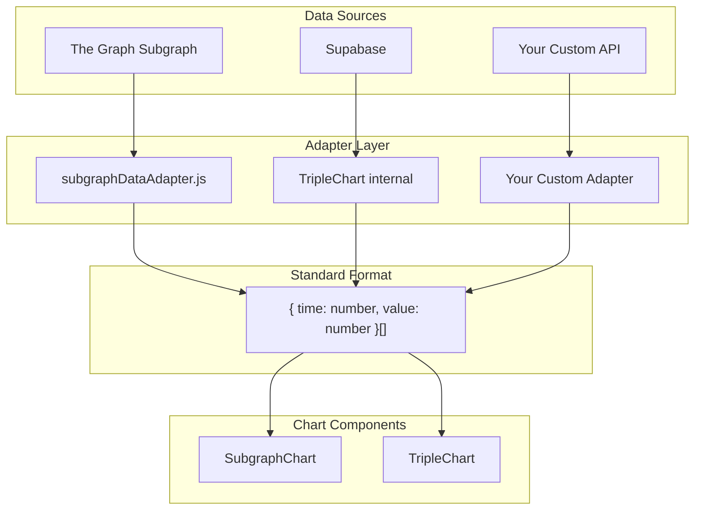

# SubgraphChart Data Interface

This document describes the **exact data interface** required by `SubgraphChart` and related chart components. If you're integrating data from a new source, you **must** create an adapter that transforms your data into this format.

---

## Quick Reference

```javascript
// Required format for chart data points
{ time: 1704067200, value: 100.9 }
```

| Field | Type | Description |
|-------|------|-------------|
| `time` | `number` | Unix timestamp in **seconds** (not milliseconds) |
| `value` | `number` | Price as a float |

---

## Complete Hook Interface

The `useSubgraphData` hook returns the following structure. Any custom adapter **must** return this exact shape:

```typescript
interface SubgraphDataResult {
  // Historical data arrays (for chart lines)
  yesData: { time: number; value: number }[];
  noData: { time: number; value: number }[];
  
  // Latest prices (for ChartParameters display)
  yesPrice: number | null;
  noPrice: number | null;
  
  // Pool metadata
  yesPool: {
    address: string;
    name: string;
    outcomeSide: "YES";
    price: number;
  } | null;
  
  noPool: {
    address: string;
    name: string;
    outcomeSide: "NO";
    price: number;
  } | null;
  
  // Status
  hasData: boolean;
  lastUpdated: Date;
  loading: boolean;
  error: string | null;
  
  // Actions
  refetch: (silent?: boolean) => Promise<void>;
}
```

---

## Creating a Custom Adapter

If your data source returns a different format, create an adapter module.

### Example: Adapting from a REST API

```javascript
// src/adapters/myCustomAdapter.js

/**
 * Example: Your API returns:
 * { timestamp_ms: 1704067200000, close_price: "100.9" }
 * 
 * Required output:
 * { time: 1704067200, value: 100.9 }
 */
export function adaptMyDataToChartFormat(rawData) {
  if (!rawData || !Array.isArray(rawData)) return [];

  return rawData
    .map(item => ({
      time: Math.floor(item.timestamp_ms / 1000), // Convert ms → seconds
      value: parseFloat(item.close_price)
    }))
    .filter(point => !isNaN(point.time) && !isNaN(point.value))
    .sort((a, b) => a.time - b.time);
}
```

### Example: Full Custom Hook

```javascript
// src/hooks/useMyCustomData.js
import { useState, useEffect, useCallback } from 'react';
import { adaptMyDataToChartFormat } from '../adapters/myCustomAdapter';

export function useMyCustomData(proposalId) {
  const [data, setData] = useState({
    yesData: [],
    noData: [],
    yesPrice: null,
    noPrice: null,
    yesPool: null,
    noPool: null,
    hasData: false,
    lastUpdated: null
  });
  const [loading, setLoading] = useState(false);
  const [error, setError] = useState(null);

  const doFetch = useCallback(async (silent = false) => {
    if (!silent) setLoading(true);
    
    try {
      const response = await fetch(`/api/my-source/${proposalId}`);
      const rawData = await response.json();
      
      // Transform to required format
      const yesData = adaptMyDataToChartFormat(rawData.yes_candles);
      const noData = adaptMyDataToChartFormat(rawData.no_candles);
      
      setData({
        yesData,
        noData,
        yesPrice: yesData.length > 0 ? yesData[yesData.length - 1].value : null,
        noPrice: noData.length > 0 ? noData[noData.length - 1].value : null,
        yesPool: { address: rawData.yes_pool, name: 'YES Pool', outcomeSide: 'YES', price: 0 },
        noPool: { address: rawData.no_pool, name: 'NO Pool', outcomeSide: 'NO', price: 0 },
        hasData: yesData.length > 0 || noData.length > 0,
        lastUpdated: new Date()
      });
    } catch (err) {
      setError(err.message);
    } finally {
      if (!silent) setLoading(false);
    }
  }, [proposalId]);

  useEffect(() => { doFetch(); }, [doFetch]);

  return { ...data, loading, error, refetch: doFetch };
}
```

---

## Critical Requirements

> [!CAUTION]
> Failing to meet these requirements will crash `lightweight-charts`.

| Requirement | Why |
|-------------|-----|
| **Unique timestamps** | `lightweight-charts` throws an error on duplicate `time` values |
| **Ascending order** | Data must be sorted by `time` from oldest → newest |
| **No NaN values** | Filter out any points where `time` or `value` is `NaN` |
| **Seconds, not milliseconds** | Unix timestamps must be in seconds |

### Recommended Deduplication Pattern

```javascript
// Use Map to keep only the LAST value per timestamp
const uniqueByTime = new Map();
for (const point of sortedData) {
  uniqueByTime.set(point.time, point);
}
return Array.from(uniqueByTime.values()).sort((a, b) => a.time - b.time);
```

---

## Existing Adapters

| File | Data Source | Use Case |
|------|-------------|----------|
| `src/adapters/subgraphDataAdapter.js` | The Graph subgraphs | Decentralized indexer |
| `src/hooks/useSubgraphData.js` | The Graph (combined) | React hook for SubgraphChart |
| `src/components/chart/TripleChart.jsx` | Supabase `pool_candles` | Legacy centralized DB |

---

## Data Flow Diagram



---

## Summary

To integrate a new data source:

1. **Create an adapter** in `src/adapters/` that transforms to `{ time, value }[]`
2. **Create a hook** in `src/hooks/` that returns the full `SubgraphDataResult` interface
3. **Ensure deduplication** and ascending sort before passing to charts
4. **Test with** `lightweight-charts` to verify no runtime errors
