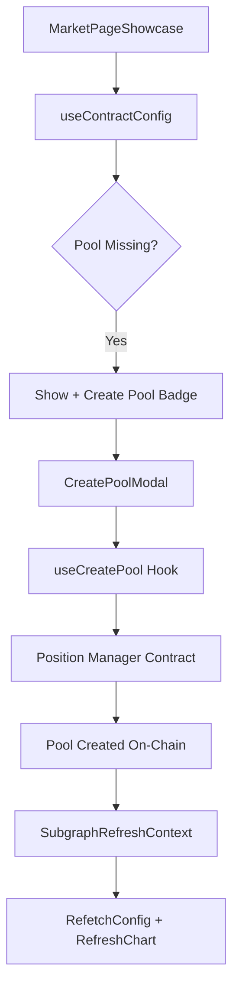

# Create Pool Modal - Implementation Documentation

## Overview

The Create Pool Modal is a self-healing UI feature that allows users to create missing pools for Futarchy proposals directly from the market page. This documentation covers the full implementation including subgraph integration, SDK interactions, and UI flow.

---

## Architecture



---

## Key Components

### 1. useContractConfig.js
**Path:** `src/hooks/useContractConfig.js`

Fetches contract configuration from Supabase or Subgraph. Detects missing pools by returning `null` addresses.

```javascript
// Returns:
{ 
  config,           // Full config object
  loading,          // Boolean
  error,            // Error object if any
  refetch           // Function to trigger refetch
}

// Key pool detection:
config.POOL_CONFIG_YES?.address  // null = pool missing
config.POOL_CONFIG_NO?.address   // null = pool missing
```

### 2. CreatePoolModal.jsx
**Path:** `src/components/futarchyFi/marketPage/CreatePoolModal.jsx`

Modal component for pool creation UI.

**Props:**
| Prop | Type | Description |
|------|------|-------------|
| `isOpen` | boolean | Modal visibility |
| `onClose` | function | Close handler |
| `config` | object | Contract config from useContractConfig |
| `missingPools` | array | Optional explicit list of missing pools |
| `onPoolCreated` | function | Callback after successful creation (triggers refetch) |

### 3. useCreatePool.js
**Path:** `src/hooks/useCreatePool.js`

Hook that handles the actual pool creation transaction.

**Returns:**
```javascript
{
  createPool,      // Function to create pool
  reset,           // Reset state
  getExplorerLink, // Get block explorer link
  status,          // { type: 'idle'|'pending'|'success'|'error', message: string }
  txHash,          // Transaction hash
  poolAddress,     // Created pool address (from Initialize event)
  isCreating,      // Boolean
  isConnected      // Wallet connection status
}
```

---

## Pool Types Configuration

Located in `CreatePoolModal.jsx`:

```javascript
const ENABLED_POOL_CATEGORIES = {
    conditional: true,   // YES/NO Conditional pools (enabled)
    prediction: false,   // YES/NO Prediction pools (disabled)
    expectedValue: false // YES/NO Expected Value pools (disabled)
};
```

### Pool Type Token Mapping

| Pool Type | Token0 | Token1 | Label Example |
|-----------|--------|--------|---------------|
| CONDITIONAL_YES | YES_Company | YES_Currency | YES_GNO / YES_sDAI |
| CONDITIONAL_NO | NO_Company | NO_Currency | NO_GNO / NO_sDAI |
| PREDICTION_YES | YES_Currency | Base_Currency | YES_sDAI / sDAI |
| PREDICTION_NO | NO_Currency | Base_Currency | NO_sDAI / sDAI |

---

## Chain Configuration

**Path:** `src/components/debug/constants/chainConfig.js`

```javascript
const CHAIN_CONFIG = {
  1: {  // Ethereum Mainnet
    name: 'Ethereum',
    amm: 'uniswap',
    positionManager: '0xC36442b4a4522E871399CD717aBDD847Ab11FE88',
    poolFactory: '0x1F98431c8aD98523631AE4a59f267346ea31F984',
    defaultFeeTier: 3000
  },
  100: {  // Gnosis Chain
    name: 'Gnosis',
    amm: 'algebra',
    positionManager: '0x91fD594c46D8B01E62dBDeBed2401dde01817834'
  }
};
```

---

## Pool Creation Flow

### 1. Price to sqrtPriceX96 Conversion

```javascript
function priceToSqrtPriceX96(price) {
    const sqrtPrice = Math.sqrt(price);
    const Q96 = 2n ** 96n;
    return BigInt(Math.floor(sqrtPrice * Number(Q96)));
}
```

### 2. Token Ordering (AMM Standard)

```javascript
// AMMs require token0 < token1 by address
function getAMMOrder(token0, token1) {
    const needsReorder = token0.toLowerCase() > token1.toLowerCase();
    return {
        ammToken0: needsReorder ? token1 : token0,
        ammToken1: needsReorder ? token0 : token1,
        needsReorder  // If true, price must be inverted
    };
}
```

### 3. Contract Calls

**Uniswap V3 (Chain 1):**
```javascript
positionManager.createAndInitializePoolIfNecessary(
    ammToken0,
    ammToken1,
    feeTier,      // e.g., 3000 = 0.3%
    sqrtPriceX96,
    { gasLimit: 5000000 }
)
```

**Algebra (Chain 100):**
```javascript
positionManager.createAndInitializePoolIfNecessary(
    ammToken0,
    ammToken1,
    sqrtPriceX96,
    { gasLimit: 16000000 }  // Higher for Algebra
)
```

---

## Subgraph Integration

### Source Detection

The subgraph source is determined by URL parameter:
- `?useContractSource=subgraph-100` → Gnosis subgraph
- `?useContractSource=subgraph-1` → Ethereum subgraph

### Query (via subgraphConfigAdapter.js)

```graphql
query GetProposal($id: ID!) {
  proposal(id: $id) {
    id
    conditionId
    marketMaker
    pools {
      id
      token0
      token1
      sqrtPriceX96
    }
    # ... more fields
  }
}
```

### Missing Pool Detection

When subgraph returns no pools for a proposal:
```javascript
// In useContractConfig.js
POOL_CONFIG_YES: isSubgraphSource && !metadata.conditional_pools?.yes?.address 
    ? null 
    : metadata.conditional_pools?.yes?.address
```

---

## Post-Creation Refresh

### SubgraphRefreshContext

**Path:** `src/contexts/SubgraphRefreshContext.jsx`

Provides refresh functions:
```javascript
const { refreshChart, refreshTrades, refreshAll } = useSubgraphRefresh();
```

### Refresh Sequence (3s after success)

```javascript
useEffect(() => {
    if (status.type === 'success' && poolAddress) {
        const timer = setTimeout(() => {
            refreshChart();        // Update SubgraphChart
            onPoolCreated?.();    // Refetch useContractConfig
        }, 3000);
        return () => clearTimeout(timer);
    }
}, [status.type, poolAddress]);
```

---

## UI/UX Features

### Button Colors
- **YES Pool Selected:** Blue (`futarchyBlue3`, `futarchyBlue6`)
- **NO Pool Selected:** Gold (`futarchyGold3`, `futarchyGold6`)
- **Disabled:** Gray

### Modal Styling
Matches `AddLiquidityModal` with light/dark theme support using futarchy design tokens.

---

## Error Handling

| Error | Message |
|-------|---------|
| No wallet | "Please connect your wallet" |
| Wrong chain | Auto-switches via `switchChainAsync` |
| User rejects | "Transaction rejected by user" |
| Insufficient gas | "Insufficient funds for gas" |
| Pool exists | Transaction succeeds but returns existing pool |

---

## Files Modified/Created

| File | Action | Purpose |
|------|--------|---------|
| `src/hooks/useCreatePool.js` | Created | Pool creation logic |
| `src/components/futarchyFi/marketPage/CreatePoolModal.jsx` | Created | Modal UI |
| `src/hooks/useContractConfig.js` | Modified | Added `refetch` function |
| `src/components/debug/constants/chainConfig.js` | Modified | Added positionManager addresses |
| `src/components/futarchyFi/marketPage/MarketPageShowcase.jsx` | Modified | Badge + modal integration |
