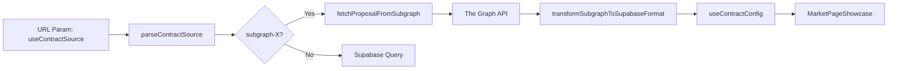

# Subgraph Proposal Config - Implementation Documentation

## Overview

This document explains how **Futarchy proposal data is fetched from The Graph subgraph** and adapted to the existing `useContractConfig` format, enabling the frontend to work in a fully decentralized mode without Supabase.

---

## Architecture



---

## Subgraph Endpoints

**Path:** `src/adapters/subgraphConfigAdapter.js`

```javascript
export const SUBGRAPH_ENDPOINTS = {
    1: 'https://api.studio.thegraph.com/query/1718249/uniswap-proposal-candles/version/latest',
    100: 'https://api.studio.thegraph.com/query/1718249/algebra-proposals-candles/version/latest'
};
```

| Chain | Network | Subgraph |
|-------|---------|----------|
| 1 | Ethereum Mainnet | `uniswap-proposal-candles` |
| 100 | Gnosis Chain | `algebra-proposals-candles` |

---

## URL Parameter

To use subgraph as data source, append to market URL:

```
?useContractSource=subgraph-100   # Gnosis
?useContractSource=subgraph-1     # Ethereum
```

### Source Detection

```javascript
function parseContractSource(sourceParam) {
    if (!sourceParam) {
        return { type: 'supabase' };
    }

    const match = sourceParam.match(/^subgraph-(\d+)$/);
    if (match) {
        const chainId = parseInt(match[1], 10);
        if (SUBGRAPH_ENDPOINTS[chainId]) {
            return { type: 'subgraph', chainId };
        }
    }

    return { type: 'supabase' };
}
```

---

## GraphQL Query

```graphql
{
  proposal(id: "0x...") {
    id
    marketName
    companyToken { id symbol decimals }
    currencyToken { id symbol decimals }
    outcomeTokens { id symbol decimals }
    pools { 
      id 
      name 
      type 
      outcomeSide 
      price
      token0 { id symbol }
      token1 { id symbol }
    }
  }
}
```

### Query Fields

| Field | Description |
|-------|-------------|
| `id` | Proposal contract address (lowercased) |
| `marketName` | Human-readable market title |
| `companyToken` | Base company token (e.g., GNO) |
| `currencyToken` | Base currency token (e.g., sDAI) |
| `outcomeTokens` | YES/NO wrapped tokens |
| `pools` | All pools with type and outcome side |

---

## Data Transformation

### Token Matching

```javascript
const findToken = (prefix, baseSymbol) => {
    return outcomeTokens.find(t =>
        t.symbol === `${prefix}_${baseSymbol}` ||
        t.symbol.toLowerCase() === `${prefix.toLowerCase()}_${baseSymbol.toLowerCase()}`
    );
};

const yesCompany = findToken('YES', companyToken?.symbol);  // e.g., YES_GNO
const noCompany = findToken('NO', companyToken?.symbol);    // e.g., NO_GNO
const yesCurrency = findToken('YES', currencyToken?.symbol); // e.g., YES_sDAI
const noCurrency = findToken('NO', currencyToken?.symbol);   // e.g., NO_sDAI
```

### Pool Matching

```javascript
const findPool = (type, side) => {
    return pools.find(p =>
        p.type === type &&
        p.outcomeSide?.toUpperCase() === side.toUpperCase()
    );
};

const conditionalYes = findPool('CONDITIONAL', 'YES');
const conditionalNo = findPool('CONDITIONAL', 'NO');
const predictionYes = findPool('PREDICTION', 'YES');
// ...
```

---

## Output Format (Supabase Compatible)

```javascript
{
    id: proposalAddress,
    title: marketName,
    type: 'proposal',
    
    metadata: {
        chain: chainId,
        title: marketName,
        
        // Contract addresses
        contractInfos: {
            conditionalTokens: '0x...',
            wrapperService: '0x...',
            futarchy: { router: '0x...' }
        },
        
        // Token configurations
        companyTokens: {
            base: { tokenSymbol: 'GNO', wrappedCollateralTokenAddress: '0x...' },
            yes: { tokenSymbol: 'YES_GNO', wrappedCollateralTokenAddress: '0x...' },
            no: { tokenSymbol: 'NO_GNO', wrappedCollateralTokenAddress: '0x...' }
        },
        
        currencyTokens: {
            base: { tokenSymbol: 'sDAI', wrappedCollateralTokenAddress: '0x...' },
            yes: { tokenSymbol: 'YES_sDAI', wrappedCollateralTokenAddress: '0x...' },
            no: { tokenSymbol: 'NO_sDAI', wrappedCollateralTokenAddress: '0x...' }
        },
        
        // Pool configurations (null if missing)
        conditional_pools: {
            yes: { address: '0x...', tokenCompanySlot: 1 },
            no: { address: '0x...', tokenCompanySlot: 0 }
        },
        
        prediction_pools: {
            yes: { address: '0x...', tokenBaseSlot: 0 },
            no: null  // Example: pool doesn't exist
        },
        
        // Source indicator
        _source: 'subgraph',
        _chainId: 100
    },
    
    event_status: 'open',
    resolution_status: 'open'
}
```

---

## Integration with useContractConfig

**Path:** `src/hooks/useContractConfig.js`

```javascript
// In fetchContractConfig()
const sourceParam = urlParams.get('useContractSource');
const { type: sourceType, chainId: sourceChainId } = parseContractSource(sourceParam);

if (sourceType === 'subgraph') {
    const subgraphData = await fetchMarketEventData(proposalId, sourceParam);
    if (subgraphData) {
        data = subgraphData;
        isSubgraphSource = true;
    }
}
```

### Ghost Pool Fix

When using subgraph, if pools are not found, they return `null` instead of falling back to hardcoded addresses:

```javascript
POOL_CONFIG_YES: forceTestPools 
    ? TEST_POOLS.yes 
    : (metadata.conditional_pools?.yes?.address || 
       (isSubgraphSource ? null : fallbackAddress));  // null for subgraph
```

---

## Chain-Specific Contract Addresses

```javascript
const CHAIN_CONFIG = {
    1: {  // Ethereum
        factoryAddress: '0xf9369c0F7a84CAC3b7Ef78c837cF7313309D3678',
        routerAddress: '0xAc9Bf8EbA6Bd31f8E8c76f8E8B2AAd0BD93f98Dc',
        conditionalTokens: '0xC59b0e4De5F1248C1140964E0fF287B192407E0C'
    },
    100: {  // Gnosis
        factoryAddress: '0xa6cB18FCDC17a2B44E5cAd2d80a6D5942d30a345',
        routerAddress: '0x7495a583ba85875d59407781b4958ED6e0E1228f',
        conditionalTokens: '0xCeAfDD6bc0bEF976fdCd1112955828E00543c0Ce',
        wrapperService: '0xc14f5d2B9d6945EF1BA93f8dB20294b90FA5b5b1'
    }
};
```

---

## Exported Functions

| Function | Purpose |
|----------|---------|
| `fetchProposalFromSubgraph(address, chainId)` | Fetch raw data from subgraph |
| `transformSubgraphToSupabaseFormat(data, address, chainId)` | Convert to Supabase format |
| `parseContractSource(sourceParam)` | Parse URL parameter |
| `fetchMarketEventData(proposalId, sourceParam)` | Main entry point |

---

## Example Usage

```javascript
import { fetchMarketEventData, parseContractSource } from '@/adapters/subgraphConfigAdapter';

// In useContractConfig
const sourceParam = 'subgraph-100';
const source = parseContractSource(sourceParam);
// → { type: 'subgraph', chainId: 100 }

const data = await fetchMarketEventData(proposalAddress, sourceParam);
// → Supabase-compatible format with pools, tokens, etc.
```

---

## Files

| File | Purpose |
|------|---------|
| `src/adapters/subgraphConfigAdapter.js` | Subgraph fetch and transform logic |
| `src/hooks/useContractConfig.js` | Consumes transformed data |
