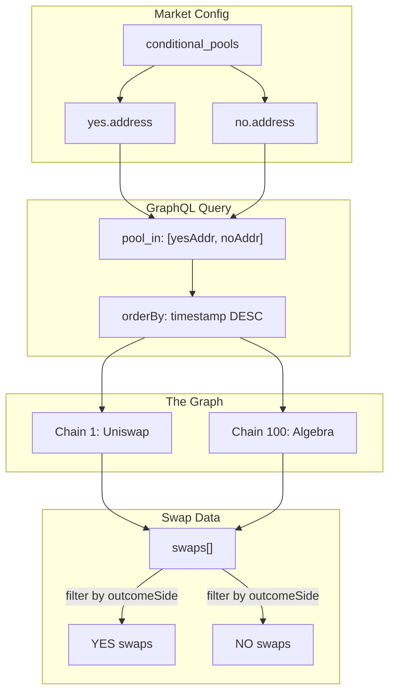

# Subgraph Swaps - Data Fetching Documentation

This document describes how swap data is fetched from The Graph subgraphs for displaying recent trading activity.

---

## Subgraph Endpoints

| Chain | Network | Endpoint |
|-------|---------|----------|
| 1 | Ethereum (Uniswap V3) | `https://api.studio.thegraph.com/query/1718249/uniswap-proposal-candles/version/latest` |
| 100 | Gnosis (Algebra/Swapr) | `https://api.studio.thegraph.com/query/1718249/algebra-proposals-candles/version/latest` |

---

## Swap Entity Schema

Both subgraphs share the same schema:

```graphql
type Swap {
  id: ID!                    # Unique swap identifier
  transactionHash: Bytes!    # On-chain transaction hash
  timestamp: BigInt!         # Unix timestamp (seconds)
  pool: Pool!                # Related pool entity
  sender: Bytes!             # Address that initiated the swap
  recipient: Bytes!          # Address that received tokens
  origin: Bytes!             # Original transaction sender
  amount0: BigDecimal!       # Delta of token0 (+ or -)
  amount1: BigDecimal!       # Delta of token1 (+ or -)
  amountIn: BigDecimal!      # Absolute input amount
  amountOut: BigDecimal!     # Absolute output amount
  tokenIn: WhitelistedToken! # Token being sold
  tokenOut: WhitelistedToken! # Token being bought
  price: BigDecimal!         # Execution price
}

type Pool {
  id: ID!                    # Pool contract address
  name: String!              # e.g., "YES_AAVE / YES_GHO"
  type: String!              # "CONDITIONAL" | "PREDICTION" | "EXPECTED_VALUE"
  outcomeSide: String        # "yes" | "no" | null
  token0: WhitelistedToken!
  token1: WhitelistedToken!
  price: BigDecimal!         # Current pool price
  proposal: Proposal
}

type WhitelistedToken {
  id: ID!                    # Token contract address
  symbol: String!            # Token symbol (e.g., "YES_GNO")
  name: String!              # Full token name
  decimals: BigInt!          # Token decimals (usually 18)
}
```

---

## Fetching Swaps for YES/NO Pools

### Single Query for Both Pools

Use `pool_in` filter to fetch swaps from multiple pools in **one request**:

```graphql
query GetSwapsForPools($poolIds: [String!]!, $limit: Int!) {
    swaps(
        where: { pool_in: $poolIds }
        first: $limit
        orderBy: timestamp
        orderDirection: desc
    ) {
        id
        transactionHash
        timestamp
        amountIn
        amountOut
        price
        tokenIn {
            id
            symbol
            decimals
        }
        tokenOut {
            id
            symbol
            decimals
        }
        pool {
            id
            name
            type
            outcomeSide
        }
    }
}
```

### Variables

```javascript
const variables = {
    poolIds: [
        "0xd4776ea355326c3d9ab3ff9417f12d6c8718066f", // YES pool (lowercase!)
        "0x08d364bf5ed8698790114a56678d14b5d6a89a77"  // NO pool (lowercase!)
    ],
    limit: 50
};
```

> **⚠️ Important**: Pool addresses must be **lowercase** for GraphQL filtering to work.

---

## JavaScript Implementation

### Pure JavaScript (Node.js compatible)

```javascript
const ENDPOINTS = {
    1: 'https://api.studio.thegraph.com/query/1718249/uniswap-proposal-candles/version/latest',
    100: 'https://api.studio.thegraph.com/query/1718249/algebra-proposals-candles/version/latest'
};

async function fetchSwapsForPools(chainId, yesPoolAddress, noPoolAddress, limit = 50) {
    const endpoint = ENDPOINTS[chainId];
    
    // CRITICAL: Lowercase addresses for GraphQL
    const poolIds = [
        yesPoolAddress.toLowerCase(),
        noPoolAddress.toLowerCase()
    ];

    const query = `{
        swaps(
            where: { pool_in: ${JSON.stringify(poolIds)} }
            first: ${limit}
            orderBy: timestamp
            orderDirection: desc
        ) {
            id
            transactionHash
            timestamp
            amountIn
            amountOut
            price
            tokenIn { symbol decimals }
            tokenOut { symbol decimals }
            pool { name type outcomeSide }
        }
    }`;

    const response = await fetch(endpoint, {
        method: 'POST',
        headers: { 'Content-Type': 'application/json' },
        body: JSON.stringify({ query })
    });

    const result = await response.json();
    return result.data?.swaps || [];
}
```

### Usage with conditional_pools config

```javascript
// Given a market config with conditional_pools:
const config = {
    conditional_pools: {
        yes: { address: "0xd4776Ea355326C3D9Ab3Ff9417F12D6c8718066F" },
        no: { address: "0x08D364Bf5ED8698790114a56678d14b5d6a89A77" }
    }
};

// Fetch recent swaps
const swaps = await fetchSwapsForPools(
    1, // Chain ID (1 = Ethereum, 100 = Gnosis)
    config.conditional_pools.yes.address,
    config.conditional_pools.no.address,
    50 // Limit
);

// Separate by outcome
const yesSwaps = swaps.filter(s => s.pool.outcomeSide === 'yes');
const noSwaps = swaps.filter(s => s.pool.outcomeSide === 'no');
```

---

## Response Format

Each swap object contains:

```javascript
{
  id: "0xc9c3572dc8cbab527221...-0",
  transactionHash: "0xc9c3572dc8cbab527221062649a7f67a4f73e5121beb854e4deb70b81c5ca829",
  timestamp: "1736796479",           // Unix seconds
  amountIn: "0.000068",
  amountOut: "0.010000",
  price: "146.07850659",
  tokenIn: {
    symbol: "NO_AAVE",
    decimals: "18"
  },
  tokenOut: {
    symbol: "NO_GHO",
    decimals: "18"
  },
  pool: {
    name: "NO_AAVE / NO_GHO",
    type: "CONDITIONAL",
    outcomeSide: "no"
  }
}
```

---

## Formatting for Display

```javascript
function formatSwap(swap) {
    const date = new Date(parseInt(swap.timestamp) * 1000);
    const formattedDate = date.toLocaleDateString('en-US', {
        month: 'short',
        day: 'numeric',
        hour: '2-digit',
        minute: '2-digit'
    });

    return {
        date: formattedDate,
        side: swap.pool.outcomeSide?.toUpperCase() || 'UNKNOWN',
        trade: `${parseFloat(swap.amountIn).toFixed(4)} ${swap.tokenIn.symbol} → ${parseFloat(swap.amountOut).toFixed(4)} ${swap.tokenOut.symbol}`,
        price: parseFloat(swap.price).toFixed(4),
        txHash: swap.transactionHash,
        txUrl: `https://etherscan.io/tx/${swap.transactionHash}` // Chain 1
        // For Chain 100: `https://gnosisscan.io/tx/${swap.transactionHash}`
    };
}
```

---

## Data Flow Diagram



---

## Pool Types Reference

| Type | Description | Example Pool Name |
|------|-------------|-------------------|
| `CONDITIONAL` | Wrapped conditional tokens | `YES_AAVE / YES_GHO` |
| `PREDICTION` | Probability pools | `YES_sDAI / sDAI` |
| `EXPECTED_VALUE` | Expected value pools | `YES_GNO / sDAI` |

---

## Filtering Swaps by User Wallet

The Swap entity has three address fields:

| Field | Description | Use Case |
|-------|-------------|----------|
| `sender` | Address that called the swap function | Often a router contract |
| `recipient` | Address that received output tokens | May differ from user |
| `origin` | **Original transaction sender** | ✅ **Use this for user wallet** |

### Query by User Wallet

Use the `origin` field to filter swaps by a specific user:

```graphql
query GetUserSwaps($userAddress: String!, $limit: Int!) {
    swaps(
        where: { origin: $userAddress }
        first: $limit
        orderBy: timestamp
        orderDirection: desc
    ) {
        id
        transactionHash
        timestamp
        amountIn
        amountOut
        price
        origin
        tokenIn { symbol decimals }
        tokenOut { symbol decimals }
        pool { name type outcomeSide }
    }
}
```

### Variables

```javascript
const variables = {
    userAddress: "0x645a3d9208523bbfee980f7269ac72c61dd3b552", // lowercase!
    limit: 50
};
```

### JavaScript Implementation

```javascript
async function fetchUserSwaps(chainId, userAddress, limit = 50) {
    const endpoint = ENDPOINTS[chainId];
    
    // CRITICAL: Lowercase for GraphQL filtering
    const userLower = userAddress.toLowerCase();

    const query = `{
        swaps(
            where: { origin: "${userLower}" }
            first: ${limit}
            orderBy: timestamp
            orderDirection: desc
        ) {
            transactionHash
            timestamp
            amountIn
            amountOut
            price
            tokenIn { symbol }
            tokenOut { symbol }
            pool { name type outcomeSide }
        }
    }`;

    const response = await fetch(endpoint, {
        method: 'POST',
        headers: { 'Content-Type': 'application/json' },
        body: JSON.stringify({ query })
    });

    const result = await response.json();
    return result.data?.swaps || [];
}

// Usage
const mySwaps = await fetchUserSwaps(100, '0x645A3D9208523bbFEE980f7269ac72C61Dd3b552');
console.log(`Found ${mySwaps.length} swaps for this wallet`);
```

### Combine User + Pool Filter

Filter a user's swaps for specific YES/NO pools only:

```graphql
query GetUserSwapsForPools($userAddress: String!, $poolIds: [String!]!, $limit: Int!) {
    swaps(
        where: { 
            origin: $userAddress,
            pool_in: $poolIds 
        }
        first: $limit
        orderBy: timestamp
        orderDirection: desc
    ) {
        transactionHash
        timestamp
        amountIn
        amountOut
        price
        tokenIn { symbol decimals }
        tokenOut { symbol decimals }
        pool { name type outcomeSide }
    }
}
```

### Complete Example

Given a market config with conditional pools:

```javascript
const USER_ADDRESS = '0x645A3D9208523bbFEE980f7269ac72C61Dd3b552';

const conditionalPools = {
    yes: { address: "0xd4776Ea355326C3D9Ab3Ff9417F12D6c8718066F" },
    no: { address: "0x08D364Bf5ED8698790114a56678d14b5d6a89A77" }
};

async function fetchUserSwapsForPools(chainId, userAddress, poolAddresses, limit = 50) {
    const endpoint = ENDPOINTS[chainId];
    
    // CRITICAL: Lowercase all addresses
    const userLower = userAddress.toLowerCase();
    const poolIds = poolAddresses.map(p => p.toLowerCase());

    const query = `{
        swaps(
            where: { 
                origin: "${userLower}",
                pool_in: ${JSON.stringify(poolIds)}
            }
            first: ${limit}
            orderBy: timestamp
            orderDirection: desc
        ) {
            transactionHash
            timestamp
            amountIn
            amountOut
            price
            tokenIn { symbol }
            tokenOut { symbol }
            pool { name outcomeSide }
        }
    }`;

    const response = await fetch(endpoint, {
        method: 'POST',
        headers: { 'Content-Type': 'application/json' },
        body: JSON.stringify({ query })
    });

    const result = await response.json();
    return result.data?.swaps || [];
}

// Usage: Get user's swaps for specific YES/NO pools
const poolAddresses = [
    conditionalPools.yes.address,
    conditionalPools.no.address
];

const mySwaps = await fetchUserSwapsForPools(1, USER_ADDRESS, poolAddresses);
// Returns only swaps by this user in these specific pools

const yesSwaps = mySwaps.filter(s => s.pool.outcomeSide === 'yes');
const noSwaps = mySwaps.filter(s => s.pool.outcomeSide === 'no');
```

> **⚠️ Important**: The `sender` field often contains a router contract address, not the user's wallet. Always use `origin` to identify the actual user.

---

## Test Scripts

### Test swap activity for pools

```bash
node scripts/test_swap_activity.js
```

Fetches swaps for test AAVE proposal pools and displays detailed results.

### Test swaps filtered by user wallet

```bash
node scripts/test_user_swaps.js
```

Filters swaps by a specific wallet address using the `origin` field.

### Test user swaps for specific pools (combined filter)

```bash
node scripts/test_user_pool_swaps.js
```

Filters swaps by user wallet AND specific pool addresses - useful for showing a user's trade history for a specific market.

---

## Related Documentation

- [SUBGRAPH_CHART.md](./SUBGRAPH_CHART.md) - Chart component using subgraph data
- [MARKET_PAGE_SHOWCASE_DATA_FLOW.md](./MARKET_PAGE_SHOWCASE_DATA_FLOW.md) - Overall data flow

---

## Troubleshooting & Logic Details

### Issue 1: Incorrect Buy/Sell Label (Ambiguous Symbols)

**Symptom:**
Trades are labeled as "BUY" when they should be "SELL" (or vice versa), especially for markets where both the Company Token and Currency Token have similar prefixes (e.g., `YES_GNO` vs `YES_sDAI`).

**Root Cause:**
The initial logic relied solely on Regex parsing of token symbols (`/^(YES|NO)[_\s-]/`).
If both tokens match the "Conditional Token" regex (e.g., both start with `YES_`), the logic couldn't strictly determine which one was the **Outcome Token** (Company) and which was the **Collateral** (Currency).
This led to `isBuy` calculation failing (defaulting to incorrect side).

**Solution:**
We updated the logic to use **Token Roles** (`role` field) from the Subgraph, which explicitly defines the token type.

#### 1. Update GraphQL Query
We added the `role` field to the `swaps` query in `subgraphTradesClient.js`:

```graphql
tokenIn {
    id
    symbol
    decimals
    role  # <--- Added
}
tokenOut {
    id
    symbol
    decimals
    role  # <--- Added
}
```

#### 2. Update Buy/Sell Logic
We replaced the regex-only logic with a stricter Role-Based Logic in `convertSwapToTradeFormat`:

**The Rule:**
*   **BUY**: User *Receives* (`tokenOut`) the **Company Token**.
*   **SELL**: User *Gives* (`tokenIn`) the **Company Token**.

**Code Implementation:**
```javascript
const tInRole = swap.tokenIn?.role || '';
const tOutRole = swap.tokenOut?.role || '';
const isCompanyRole = (r) => r === 'YES_COMPANY' || r === 'NO_COMPANY' || r === 'COMPANY';

let isBuy = false;

if (isCompanyRole(tOutRole) && !isCompanyRole(tInRole)) {
    isBuy = true; // Receiving Company Token = Buy
} else if (isCompanyRole(tInRole) && !isCompanyRole(tOutRole)) {
    isBuy = false; // Giving Company Token = Sell
} else {
    // Fallback to Symbol Regex (Legacy)
    // ...
}
```

### Issue 2: Trades Not Updating After Swap

**Symptom:**
After performing a swap, the "Recent Trades" list doesn't update immediately.

**Solution:**
We integrated a `refreshAll()` trigger in `ConfirmSwapModal.jsx`.
When the transaction status becomes `fulfilled`, it calls `refreshAll()`, which forces `SubgraphTradesDataLayer` (and charts) to refetch data immediately.

### Debugging Tips

*   **Check Subgraph Response**: Look at the Network tab for the GraphQL query. Verify the `role` field is returning `YES_COMPANY`, `COLLATERAL`, etc.
*   **Verify Token Directions**:
    *   `tokenIn` = What the user **GAVE** to the pool.
    *   `tokenOut` = What the user **RECEIVED** from the pool.
*   **Check `tradeSource` Param**: Ensure `?tradeSource=subgraph` is active (now the default, unless `?tradeSource=supabase` is used).

