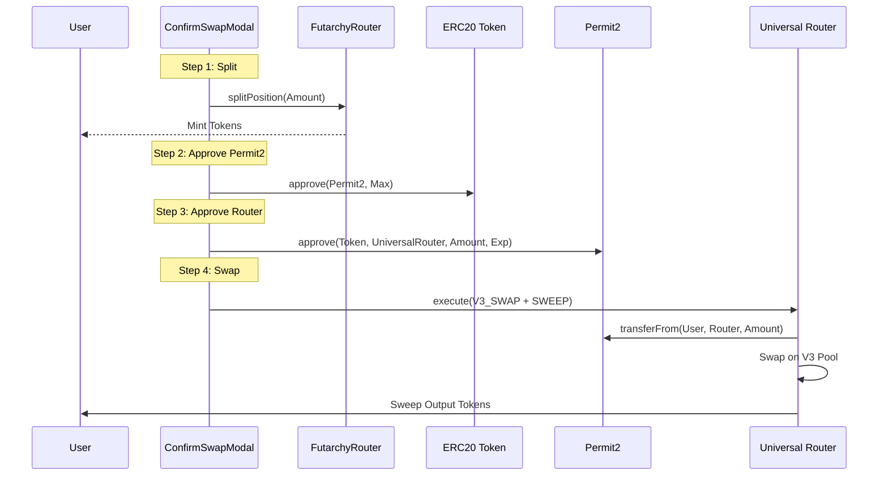

# Swap Architecture: Ethereum Mainnet (Chain ID: 1)

This document outlines the architecture for the "Split-Swap" workflow on Ethereum Mainnet, utilizing Uniswap V3 and the Universal Router with Permit2.

## Overview

*   **Chain ID**: 1 (Ethereum Mainnet)
*   **Primary DEX**: Uniswap V3
*   **Router**: Universal Router
*   **Approval Strategy**: Permit2 (Token -> Permit2 -> Universal Router)

## Workflow: "Split-Swap"

Similar to Gnosis Chain, the goal is to split collateral and swap the undesired outcome. However, the execution layer on Mainnet is significantly different due to the use of the Universal Router and Permit2 for gas efficiency and signed approvals.

### 1. Quote & Estimation
*   **Component**: `ShowcaseSwapComponent.jsx`
*   **Logic**:
    *   Uses `getUniswapV3QuoteWithPriceImpact` (QuoterV2) for accurate quoting.
    *   Calculates `additionalCollateralNeeded` using the same "Smart Split" logic.

### 2. "Smart Split" Logic
(Same as Gnosis Chain)
```javascript
SplitAmount = Max(0, RequiredInputAmount - CurrentConditionalTokenBalance)
```

### 3. Execution Flow (`ConfirmSwapModal.jsx`)

1.  **Collateral Check**:
    *   Checks `additionalCollateralNeeded`.
    *   Calls `FutarchyRouter.splitPosition` if needed.

2.  **Token Approval (Permit2 Flow)**:
    *   **Step 1: Approve Token to Permit2**:
        *   Checks `token.allowance(user, PERMIT2_ADDRESS)`.
        *   If insufficient, calls `token.approve(PERMIT2_ADDRESS, MAX_UINT256)`.
    *   **Step 2: Approve Permit2 to Universal Router**:
        *   Checks `permit2.allowance(user, token, UNIVERSAL_ROUTER)`.
        *   If insufficient (amount or expiration), calls `permit2.approve(token, UNIVERSAL_ROUTER, amount, expiration)`.
        *   *Note*: This is a signature-based approval on the Permit2 contract, not an ERC20 transaction, but it still requires a transaction on-chain to set the allowance mapping in Permit2.

3.  **Swap Execution**:
    *   **Method**: `executeUniswapV3Swap` (via `uniswapSdk.js`).
    *   **Router**: `Universal Router`.
    *   **Commands**:
        *   `V3_SWAP_EXACT_IN`: Performs the V3 swap.
        *   `SWEEP`: Sends the output tokens to the user (ensuring no dust is left in the router).
    *   **Inputs**: Encoded V3 path and sweep parameters.

## Key Components & Files

*   **`src/utils/uniswapSdk.js`**: Handles all Mainnet-specific logic (Permit2, Universal Router encoding, QuoterV2).
*   **`src/components/futarchyFi/marketPage/ConfirmSwapModal.jsx`**: Detects Chain ID 1 and forces `selectedSwapMethod = 'uniswapSdk'`.
*   **`src/utils/uniswapV3Helper.js`**: (Legacy/Alternative) Helper file, but `uniswapSdk.js` is the primary driver for the Universal Router implementation.

## Diagram


