# Swap Architecture: Gnosis Chain (Chain ID: 100)

This document outlines the architecture for the "Split-Swap" workflow on Gnosis Chain, specifically tailored for the Futarchy application.

## Overview

*   **Chain ID**: 100 (Gnosis Chain)
*   **Primary DEX**: Swapr (Algebra V3)
*   **Fallback DEX**: SushiSwap V3 / CoW Swap
*   **Router Address**: `0x...` (See `sushiswapV3Helper.js` or `constants/contracts.js`)
*   **Approval Strategy**: Standard ERC20 `approve()`

## Workflow: "Split-Swap"

The core workflow allows users to bet on outcomes by splitting collateral (e.g., sDAI) into conditional tokens (YES + NO) and then swapping the undesired outcome token for the desired one (e.g., Swap NO for YES to go "Long YES").

### 1. Quote & Estimation
*   **Component**: `ShowcaseSwapComponent.jsx`
*   **Logic**:
    *   Uses `algebraQuoter` (for Swapr) to get an exact quote.
    *   Calculates `additionalCollateralNeeded` using the "Smart Split" logic.

### 2. "Smart Split" Logic
To minimize capital inefficiency, the system only splits the *exact* amount of collateral needed to satisfy the swap input, accounting for any existing conditional tokens the user already holds.

**Formula:**
```javascript
SplitAmount = Max(0, RequiredInputAmount - CurrentConditionalTokenBalance)
```

**Example:**
*   **User Wants to Swap**: 100 YES tokens.
*   **User Holds**: 5 YES tokens (from previous activities).
*   **Calculation**: `Max(0, 100 - 5) = 95`.
*   **Action**: The system splits 95 sDAI into 95 YES + 95 NO.
*   **Result**: User now has 5 + 95 = 100 YES tokens, ready to swap.

### 3. Execution Flow (`ConfirmSwapModal.jsx`)

1.  **Collateral Check**:
    *   The modal receives `additionalCollateralNeeded` as a prop.
    *   If `> 0`, it triggers `handleCollateralAction`.

2.  **Split Transaction**:
    *   Calls `FutarchyRouter.splitPosition(proposal, collateral, amount)`.
    *   **Contract**: `FutarchyRouter`
    *   **Function**: `splitPosition`

3.  **Token Approval**:
    *   **Standard ERC20**: The system checks the allowance of the input token (e.g., YES token) for the Swap Router.
    *   If insufficient, it calls `token.approve(routerAddress, MAX_UINT256)`.

4.  **Swap Execution**:
    *   **Method**: `executeAlgebraExactSingle` (for Swapr) or `executeSushiV3RouterSwap`.
    *   **Router**: Interacts directly with the Algebra/SushiSwap V3 Router.
    *   **Call Data**:
        *   `tokenIn`: The conditional token being sold (e.g., NO).
        *   `tokenOut`: The conditional token being bought (e.g., YES).
        *   `recipient`: User's address.
        *   `amountIn`: The full amount (e.g., 100).

## Key Components & Files

*   **`src/components/futarchyFi/marketPage/ShowcaseSwapComponent.jsx`**: Handles the "Smart Split" calculation and initial quoting.
*   **`src/components/futarchyFi/marketPage/ConfirmSwapModal.jsx`**: Orchestrates the steps (Split -> Approve -> Swap).
*   **`src/utils/sushiswapV3Helper.js`**: Contains the logic for Gnosis Chain swaps (Algebra/Sushi).
*   **`src/components/refactor/utils/collateralUtils.js`**: Helper for `splitPosition`.

## Diagram

```mermaid
sequenceDiagram
    participant User
    participant UI as ShowcaseSwapComponent
    participant Modal as ConfirmSwapModal
    participant Router as FutarchyRouter
    participant DEX as Swapr/Algebra

    User->>UI: Enter Amount (e.g. 100 YES)
    UI->>UI: Calculate Smart Split (100 - 5 held = 95)
    UI->>Modal: Open with additionalCollateralNeeded = 95
    
    rect rgb(20, 20, 20)
        Note over Modal: Step 1: Split
        Modal->>Router: splitPosition(95 sDAI)
        Router-->>User: Mint 95 YES + 95 NO
    end

    rect rgb(20, 20, 20)
        Note over Modal: Step 2: Approve
        Modal->>DEX: approve(YES, MaxUint)
    end

    rect rgb(20, 20, 20)
        Note over Modal: Step 3: Swap
        Modal->>DEX: swap(100 NO -> YES)
        DEX-->>User: Receive YES tokens
    end
```


