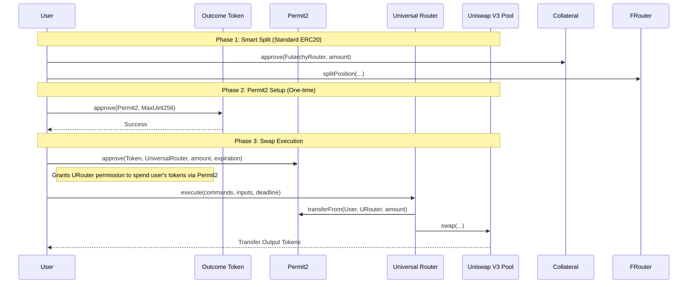

# Swap Architecture - Ethereum Mainnet (Chain 1)

This document details the swap architecture specifically for **Ethereum Mainnet (Chain ID: 1)**. It highlights the use of **Permit2** and the **Universal Router**, along with the "Smart Split" logic.

## 1. Contract Reference (Mainnet)

| Contract | Address | Purpose |
| :--- | :--- | :--- |
| **Universal Router** | `0x66a9893cc07d91d95644aedd05d03f95e1dba8af` | Entry point for all swaps. |
| **Permit2** | `0x000000000022D473030F116dDEE9F6B43aC78BA3` | Token approval management. |
| **FutarchyRouter** | `0xAc9Bf8EbA6Bd31f8E8c76f8E8B2AAd0BD93f98Dc` | Splitting collateral. |
| **USDS (Collateral)** | `0xdC035D45d973E3EC169d2276DDab16f1e407384F` | Base collateral token. |

---

## 2. Execution Flow (Permit2 + Universal Router)

On Mainnet, we use **Permit2** to save gas on approvals.

---

## 3. Smart Split Logic

The `FutarchyRouter` interaction includes a "Smart Split" optimization to minimize capital inefficiency.

**Logic:**
1.  **Calculate Requirement**: The frontend determines the exact amount of Outcome Tokens (e.g., YES_USDS) needed for the swap.
2.  **Check Balance**: It checks the user's current balance of that Outcome Token.
3.  **Determine Split Amount**: `AmountToSplit = RequiredAmount - CurrentBalance`.
4.  **Execute**: `splitPosition` is called **only** for the `AmountToSplit`.

**Example:**
*   User wants to swap **100 YES_USDS**.
*   User already holds **5 YES_USDS**.
*   **Action**: The system splits only **95 USDS** to mint the remaining 95 YES_USDS needed.

---

## 4. Detailed Call Specifications

### 4.1 Permit2 Approval
*   **Contract**: `Permit2` (`0x0000...8BA3`)
*   **Function**: `approve(address token, address spender, uint160 amount, uint48 expiration)`
*   **Data Payload**:
    *   `token`: The Outcome Token being sold (e.g., YES_USDS).
    *   `spender`: `0x66a9893cc07d91d95644aedd05d03f95e1dba8af` (Universal Router).
    *   `amount`: `MaxUint160` (To minimize future approvals).
    *   `expiration`: `281474976710655` (Max uint48, ~8 million years).

### 4.2 Universal Router Execution
*   **Contract**: `Universal Router` (`0x66a9...8af`)
*   **Function**: `execute(bytes commands, bytes[] inputs, uint256 deadline)`
*   **Commands**: `0x0004` (V3_SWAP_EXACT_IN + SWEEP)
    *   `0x00`: V3 Swap Exact In.
    *   `0x04`: Sweep (send tokens to user).

*   **Inputs (Decoded)**:
    1.  **V3 Swap Params**: `(recipient, amountIn, amountOutMin, path, payerIsUser)`
        *   `recipient`: `0x0000000000000000000000000000000000000002` (MsgSender constant).
        *   `payerIsUser`: `true` (Tells Router to pull funds from User via Permit2).
    2.  **Sweep Params**: `(token, recipient, minAmount)`
        *   `recipient`: User's actual wallet address.

---

## 5. Market Event Examples (Tesla Proposal)

**Proposal**: Tesla Shareholder Vote
**Futarchy Router**: `0xAc9Bf8EbA6Bd31f8E8c76f8E8B2AAd0BD93f98Dc`

### Scenario: User bets 100 USDS

#### Case A: "Event Will Occur" (YES)
1.  **Split**: User splits 100 USDS -> Gets 100 YES_USDS + 100 NO_USDS.
    *   `splitPosition(ProposalAddr, 0xdC03...84F, 100e18)`
2.  **Swap**: User sells **NO_USDS** to buy **YES_USDS** (Double Down) or **YES_TSLAon**.

    **Swap Call Data (Buy YES_TSLAon):**
    *   `tokenIn`: `0x...` (**NO_USDS**) (Assuming NO_USDS is sold to buy YES side, or YES_USDS sold for YES_TSLAon. Standard flow: Sell YES_USDS -> Buy YES_TSLAon)
    *   *Correction*: If betting YES, user splits USDS -> Gets YES_USDS + NO_USDS. User then sells **YES_USDS** to buy **YES_TSLAon** (Long Asset).
    *   `tokenIn`: `0x87f94FaBA3e8FD5fbb9f49F7e9Ab24E8fC6E7B7E` (**YES_USDS**)
    *   `tokenOut`: `0x192e4580d85dc767F81F8AD02428F042E3c1074e` (**YES_TSLAon**)
    *   `path`: Encoded `[YES_USDS] + [500] + [YES_TSLAon]`
    *   `amountIn`: `100000000000000000000` (100 Ether)

#### Case B: "Event Will NOT Occur" (NO)
1.  **Split**: User splits 100 USDS -> Gets 100 YES_USDS + 100 NO_USDS.
2.  **Swap**: User sells **NO_USDS** to buy **NO_TSLAon**.

    **Swap Call Data (Buy NO_TSLAon):**
    *   `tokenIn`: `0x...` (**NO_USDS**)
    *   `tokenOut`: `0x...` (**NO_TSLAon**)
    *   `path`: Encoded `[NO_USDS] + [500] + [NO_TSLAon]`
    *   `amountIn`: `100000000000000000000` (100 Ether)
