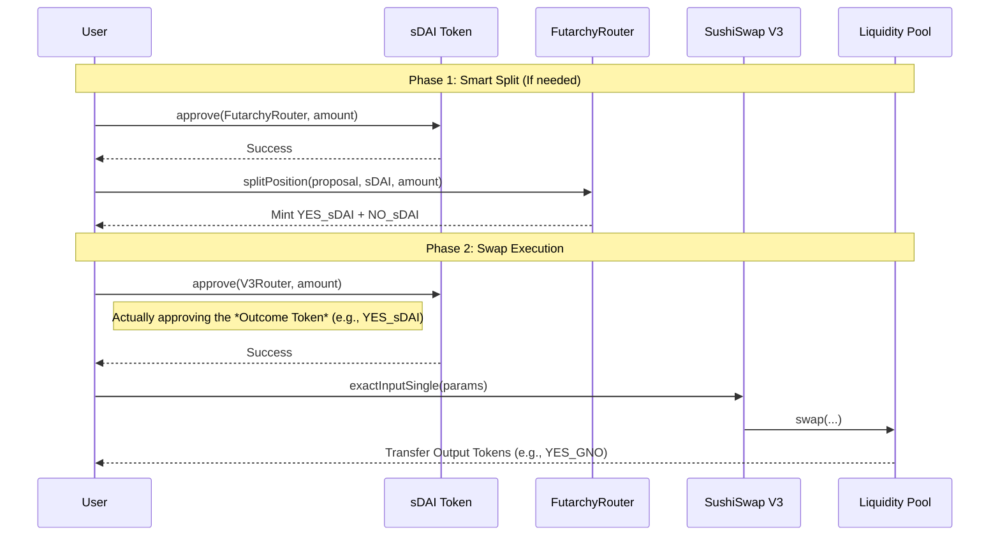

# Swap Architecture - Gnosis Chain (Chain 100)

This document details the swap architecture specifically for **Gnosis Chain (Chain ID: 100)**. It covers the standard ERC20 approval flow, the "Smart Split" collateral logic, and swap execution via SushiSwap V3 or Algebra.

## 1. Contract Reference (Gnosis)

| Contract | Address | Purpose |
| :--- | :--- | :--- |
| **FutarchyRouter** | `0x7495a583ba85875d59407781b4958ED6e0E1228f` | Splitting sDAI into YES/NO tokens. |
| **SushiSwap V3 Router** | `0x592abc3734cd0d458e6e44a2db2992a3d00283a4` | Executing swaps (YES/NO -> Outcome Tokens). |
| **Algebra (Swapr) Router**| `0xffb643e73f280b97809a8b41f7232ab401a04ee1` | Alternative execution execution. |
| **sDAI (Collateral)** | `0xaf204776c7245bF4147c2612BF6e5972Ee483701` | Base collateral token. |

---

## 2. Execution Flow

On Gnosis Chain, we use **Standard ERC20 Approvals**. There is no Permit2.



---

## 3. Smart Split Logic

The `FutarchyRouter` interaction includes a "Smart Split" optimization to minimize capital inefficiency.

**Logic:**
1.  **Calculate Requirement**: The frontend determines the exact amount of Outcome Tokens (e.g., YES_sDAI) needed for the swap.
2.  **Check Balance**: It checks the user's current balance of that Outcome Token.
3.  **Determine Split Amount**: `AmountToSplit = RequiredAmount - CurrentBalance`.
4.  **Execute**: `splitPosition` is called **only** for the `AmountToSplit`.

**Example:**
*   User wants to swap **100 YES_sDAI**.
*   User already holds **5 YES_sDAI** from a previous action.
*   **Action**: The system splits only **95 sDAI** to mint the remaining 95 YES_sDAI needed.

---

## 4. Detailed Call Specifications

### 4.1 Approval (Standard ERC20)
*   **Contract**: The Token Contract (e.g., sDAI or YES_sDAI).
*   **Function**: `approve(address spender, uint256 amount)`
*   **Data Payload**:
    *   `spender`: `0x7495a583ba85875d59407781b4958ED6e0E1228f` (FutarchyRouter) OR `0x592abc3734cd0d458e6e44a2db2992a3d00283a4` (SushiSwap V3).
    *   `amount`: The amount to split or swap (in Wei).

### 4.2 Split Position
*   **Contract**: `FutarchyRouter` (`0x7495...228f`)
*   **Function**: `splitPosition(address proposal, address collateralToken, uint256 amount)`
*   **Example Data**:
    *   `proposal`: `0xa28614aa999117C555757D56A8178F271C24d7BA` (GIP-143 Market)
    *   `collateralToken`: `0xaf204776c7245bF4147c2612BF6e5972Ee483701` (sDAI)
    *   `amount`: `1000000000000000000` (1 sDAI)

### 4.3 Swap Execution (SushiSwap V3)
*   **Contract**: `SushiSwap V3 Router` (`0x592a...83a4`)
*   **Function**: `exactInputSingle(ExactInputSingleParams params)`
*   **Struct**:
    ```solidity
    struct ExactInputSingleParams {
        address tokenIn;
        address tokenOut;
        uint24 fee;
        address recipient;
        uint256 amountIn;
        uint256 amountOutMinimum;
        uint160 sqrtPriceLimitX96;
    }
    ```

---

## 5. Market Event Examples (GIP-143)

**Proposal**: GIP-143 (Should GnosisDAO Terminate karpatkey?)
**Market Address**: `0xa28614aa999117C555757D56A8178F271C24d7BA`

### Scenario: User wants to bet 100 sDAI

#### Case A: "Event Will Occur" (YES)
1.  **Split**: User splits 100 sDAI -> Gets 100 YES_sDAI + 100 NO_sDAI.
    *   `splitPosition(0xa286...7BA, 0xaf20...701, 100e18)`
2.  **Swap**: User sells **NO_sDAI** to buy **YES_sDAI** (Double Down) or **YES_GNO**.
    *   *Example: Swapping YES_sDAI for YES_GNO (Long Gnosis)*

    **Swap Call Data (Buy YES_GNO):**
    *   `tokenIn`: `0xc8Ab2bdb2cAA0Fc30bcf6C54f273117E90f97D74` (**YES_sDAI**)
    *   `tokenOut`: `0xeE41338963B5120cdf79e0B68149A228C0c0F73a` (**YES_GNO**)
    *   `fee`: `10000` (1%)
    *   `recipient`: User Address
    *   `amountIn`: `100000000000000000000` (100 Ether)

#### Case B: "Event Will NOT Occur" (NO)
1.  **Split**: User splits 100 sDAI -> Gets 100 YES_sDAI + 100 NO_sDAI.
2.  **Swap**: User sells **YES_sDAI** to buy **NO_sDAI** (Double Down) or **NO_GNO**.

    **Swap Call Data (Buy NO_GNO):**
    *   `tokenIn`: `0xb9d258c84589d47d9c4cab20a496255556337111` (**NO_sDAI**)
    *   `tokenOut`: `0xad34b43712588fa57d80e76c5c2bcbd274bdb5c0` (**NO_GNO**)
    *   `fee`: `10000` (1%)
    *   `recipient`: User Address
    *   `amountIn`: `100000000000000000000` (100 Ether)
