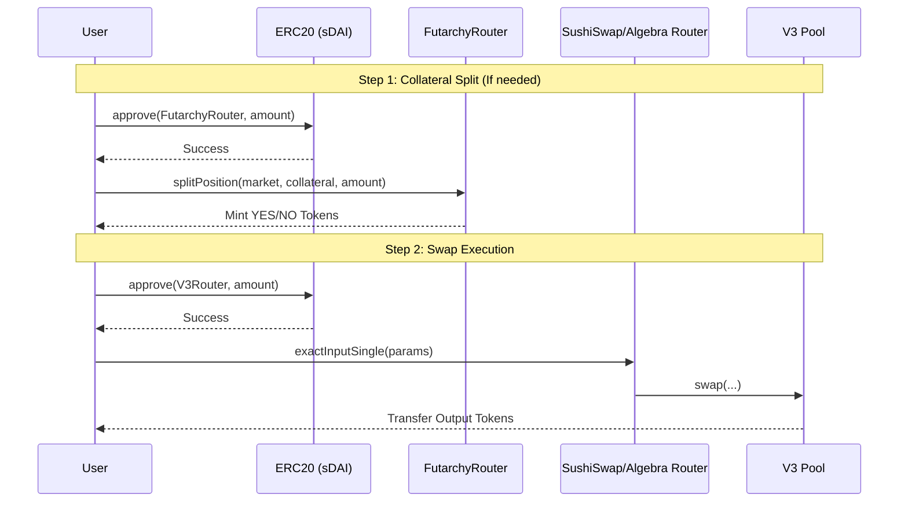
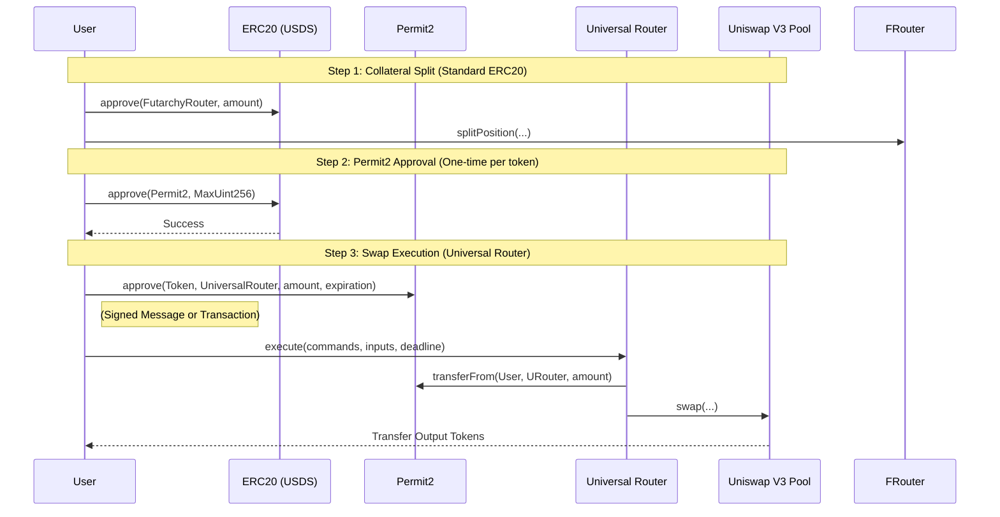

# Swap Architecture & Contract Interactions

This document provides a technical reference for the Futarchy swap workflow, detailing contract addresses, call sequences, and data payloads. It is intended for engineering review to verify safety and correctness.

## 1. Contract Reference

### Gnosis Chain (Chain ID: 100)
| Contract | Address | Purpose |
| :--- | :--- | :--- |
| **FutarchyRouter** | `0x7495a583ba85875d59407781b4958ED6e0E1228f` | Splitting/Merging collateral positions. |
| **SushiSwap V3 Router** | `0x592abc3734cd0d458e6e44a2db2992a3d00283a4` | Executing swaps via SushiSwap V3 pools. |
| **Algebra (Swapr) Router**| `0xffb643e73f280b97809a8b41f7232ab401a04ee1` | Executing swaps via Algebra/Swapr pools. |
| **CoW Settlement** | `0x9008D19f58AAbD9eD0D60971565AA8510560ab41` | Settlement contract for CoW Swap orders. |
| **Wrapper Service** | `0xc14f5d2B9d6945EF1BA93f8dB20294b90FA5b5b1` | Wrapping/Unwrapping conditional tokens. |

### Ethereum Mainnet (Chain ID: 1)
| Contract | Address | Purpose |
| :--- | :--- | :--- |
| **FutarchyRouter** | *(Same as Gnosis or Configured per Proposal)* | Splitting/Merging collateral positions. |
| **Universal Router** | `0x66a9893cc07d91d95644aedd05d03f95e1dba8af` | Executing swaps via Uniswap V3 (Entry point). |
| **Permit2** | `0x000000000022D473030F116dDEE9F6B43aC78BA3` | Handling token approvals for Universal Router. |
| **Quoter V2** | `0x61fFE014bA17989E743c5F6cB21bF9697530B21e` | Fetching on-chain quotes. |

---

## 2. Call Flow: Gnosis Chain (SushiSwap/Algebra)

This flow uses standard ERC20 approvals and direct router interaction.

### Critical Call Data (Gnosis)

**1. `FutarchyRouter.splitPosition`**
*   **Target**: `0x7495a583ba85875d59407781b4958ED6e0E1228f`
*   **Signature**: `splitPosition(address proposal, address collateralToken, uint256 amount)`
*   **Safety Check**: Ensure `proposal` matches the current market address.

**2. `SushiSwapV3Router.exactInputSingle`**
*   **Target**: `0x592abc3734cd0d458e6e44a2db2992a3d00283a4`
*   **Signature**: `exactInputSingle(ExactInputSingleParams params)`
*   **Struct `ExactInputSingleParams`**:
    *   `tokenIn`: Address of token being sold (e.g., YES_sDAI).
    *   `tokenOut`: Address of token being bought (e.g., YES_GNO).
    *   `fee`: Pool fee tier (e.g., `10000` for 1%).
    *   `recipient`: User's address.
    *   `amountIn`: Exact amount to swap.
    *   `amountOutMinimum`: Calculated based on slippage (e.g., 0.5%).
    *   `sqrtPriceLimitX96`: `0` (No limit, standard for exact input).

---

## 3. Call Flow: Ethereum Mainnet (Universal Router + Permit2)

This flow uses **Permit2** for approvals, which is a significant architectural difference.

### Critical Call Data (Mainnet)

**1. `Permit2.approve`**
*   **Target**: `0x000000000022D473030F116dDEE9F6B43aC78BA3`
*   **Purpose**: Grants Universal Router permission to spend tokens held by Permit2 on behalf of the user.
*   **Parameters**:
    *   `token`: Token address.
    *   `spender`: `0x66a9893cc07d91d95644aedd05d03f95e1dba8af` (Universal Router).
    *   `amount`: `MaxUint160` (Standard practice to minimize re-approvals).
    *   `expiration`: Timestamp (usually 30 days or 1 year).

**2. `UniversalRouter.execute`**
*   **Target**: `0x66a9893cc07d91d95644aedd05d03f95e1dba8af`
*   **Signature**: `execute(bytes commands, bytes[] inputs, uint256 deadline)`
*   **Commands**: `0x0004` (V3_SWAP_EXACT_IN + SWEEP)
    *   `0x00` (V3_SWAP_EXACT_IN): Performs the swap.
    *   `0x04` (SWEEP): Sends the output tokens to the user.
*   **Inputs**:
    *   **Swap Params**: Encoded `(recipient, amountIn, amountOutMin, path, payerIsUser)`.
        *   `recipient`: `0x00...02` (MsgSender constant, tells Router to hold funds for Sweep).
        *   `path`: Encoded `tokenIn + fee + tokenOut`.
    *   **Sweep Params**: Encoded `(token, recipient, minAmount)`.
        *   `recipient`: User's actual address.

## 4. Safety & Verification Checklist

Engineers reviewing this flow should verify:

1.  **Router Allowances**:
    *   Gnosis: User approves `SushiSwapV3Router` or `AlgebraRouter` directly.
    *   Mainnet: User approves `Permit2`, then signs/approves `Permit2` to let `UniversalRouter` spend.
2.  **Slippage Protection**:
    *   Verify `amountOutMinimum` is calculated correctly in the UI before being passed to the contract.
    *   The code uses `amountIn * (1 - slippage)` logic.
3.  **Path Verification**:
    *   Ensure the `path` or `pool` address corresponds to the correct prediction market tokens (YES/NO).
    *   The app derives these from the `MERGE_CONFIG` and `POOL_CONFIG` in the proposal configuration.
